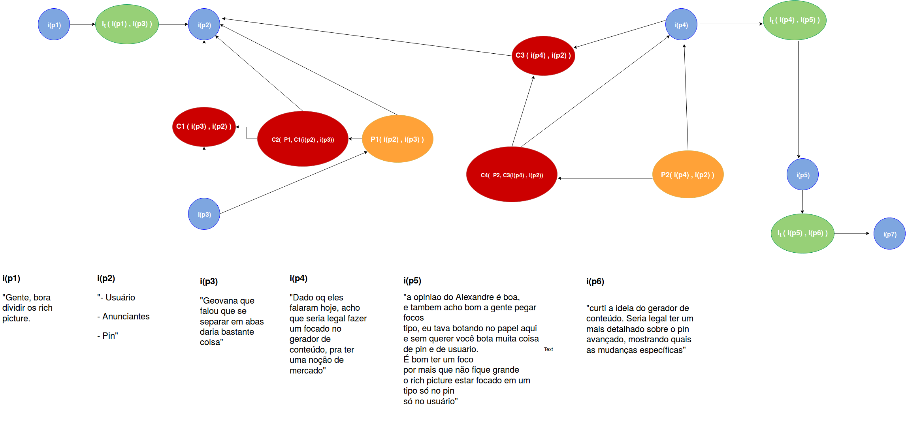
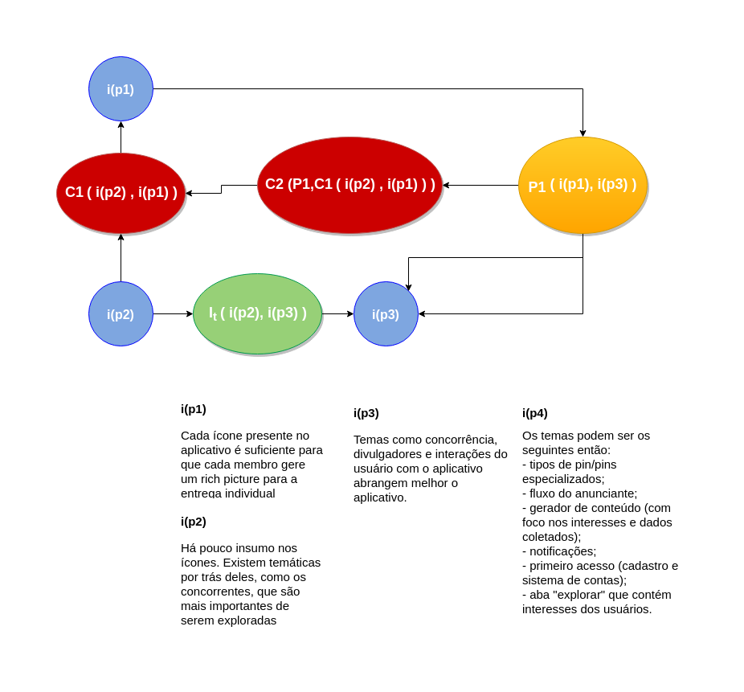

# Argumentação

## Versionamento

|  Versão | Data | Modificação | Autor |
|  :------: | :------: | :------: | :------: |
|  1.0 | 07/09/2018 | Adição da [AR1](#ar1-pin)  | Daniel Maike, Letícia Meneses e Joberth Rogers |
|  1.1 | 07/09/2018 | Adição da [AR3](#ar2-rich-picture)  | Daniel Maike, Letícia Meneses e Joberth Rogers |
|  1.2 | 17/09/2018 | Adição da [AR3](#ar3-feed)  | Alexandre Miguel, Daniel Maike, Letícia Meneses e Joberth Rogers |
|  1.3 | 03/11/2018 | Adição da [AR4](#ar4-elicitacao)  | Alexandre Miguel |
|  1.4 | 04/11/2018 | Adição da [AR5](#ar5-divisao-dos-rich-pictures)  | Letícia Meneses |
|  1.5 | 05/11/2018 | Adição da [AR6](#ar6-tema-do-rich-picture)  | Helena Goulart |

## Introdução

  A argumentação também é uma técnica usada na pré rastreabilidade, mas ao contrário do rich picture é um artefato formal. Seu principal objetivo é ajudar na resolução de conflitos entre vários argumentos usando uma visão mais técnica, a fim de buscar uma conclusão plausível para pontos de vista diferentes.

## AR1 - Pin

## AR2 - Rich Picture

## AR3 - Feed

## AR4 - Elicitação

## AR5 - Divisão dos Rich Pictures

## AR6 - Tema do Rich Picture

