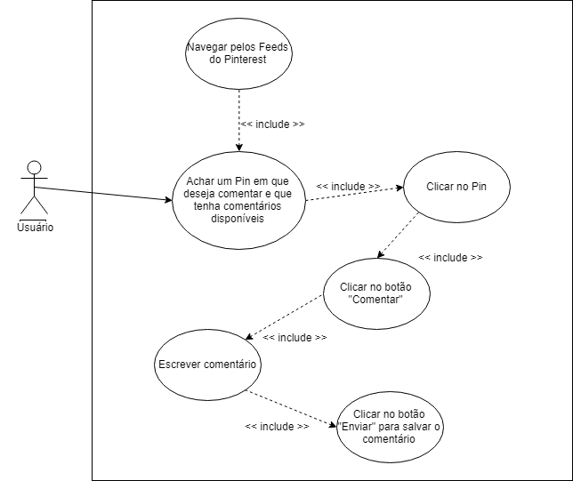
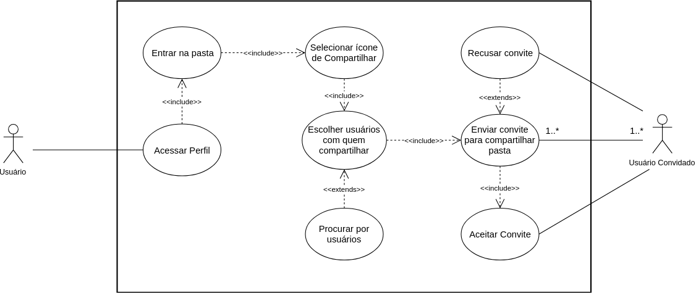
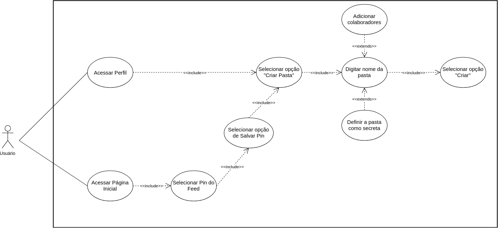
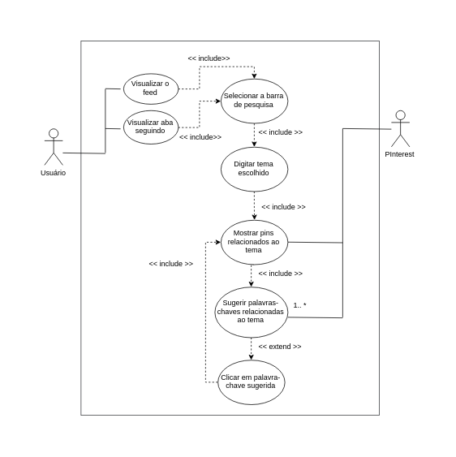
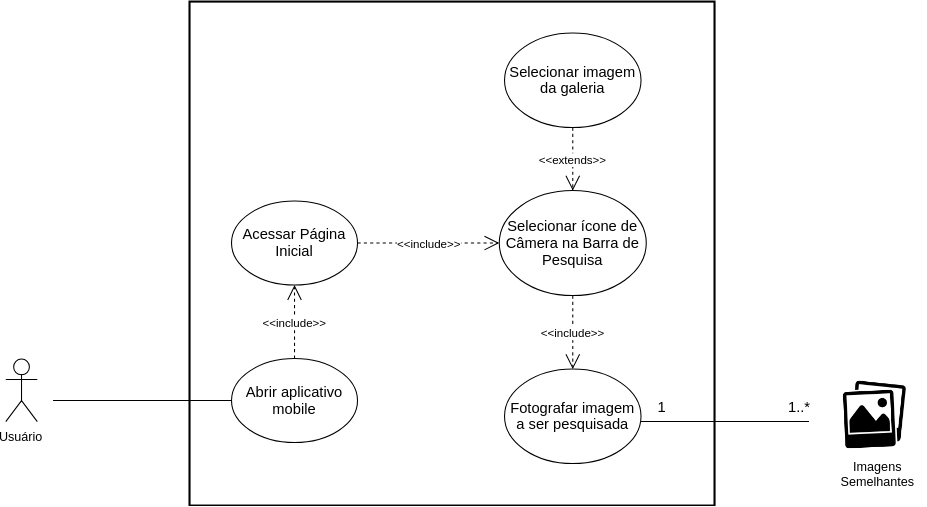
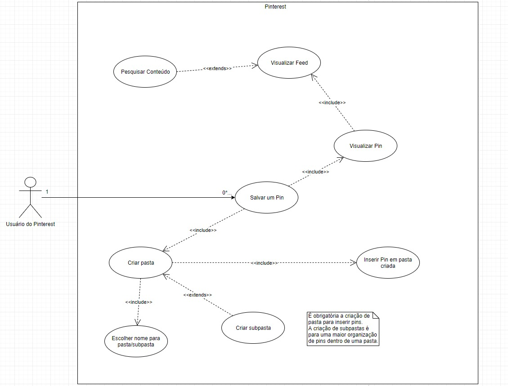
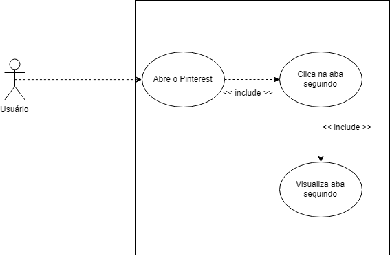
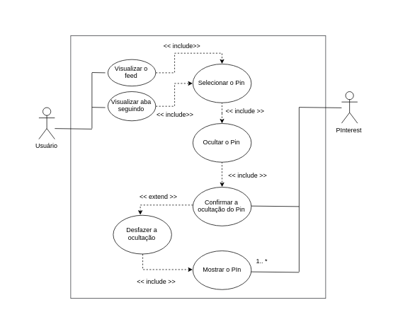
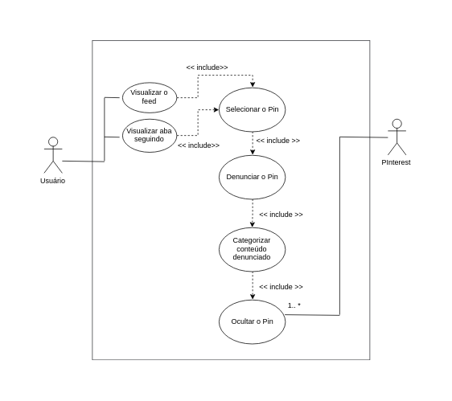

# Introdução

## Cadastro de usuário

## Cadastro de usuário

## Visualizar pin

## Comentar em um Pin

## Compartilhar Pasta

## Criar Pasta

## Definir interesses

## Editar um Pin

## Enviar um Pin

## Realizar Primeiro login

## Fazer login

## Ir para a fonte de um Pin

## Organizar Pasta

## Pesquisar por tema

## Pesquisar por foto

## Seguir outro usuário

## Salvar um Pin

## Visualizar Feed

## Visualizar aba Seguindo

## Enviar mensagem para outros usuários

## Receber notificações

## Classificação de pastas

## Ocultar um Pin

## Denunciar um Pin

## Classificar um Pin como Experimentado

## Sair do aplicativo Pinterest

## Fazer Login

## Editar Perfil
