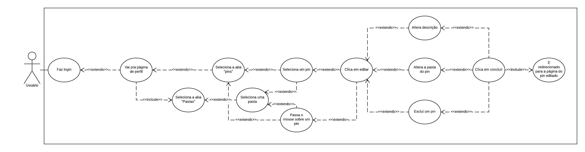
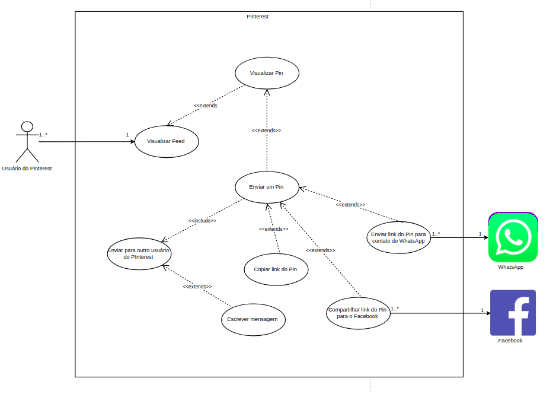
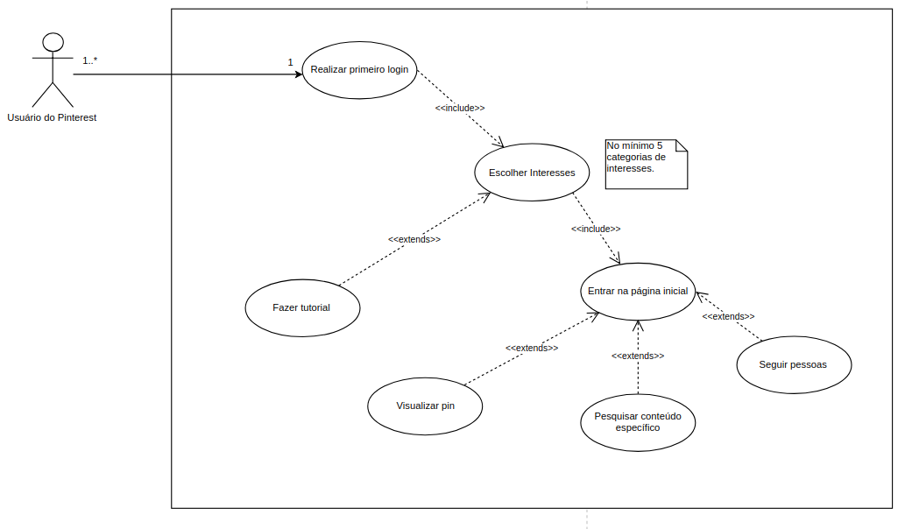
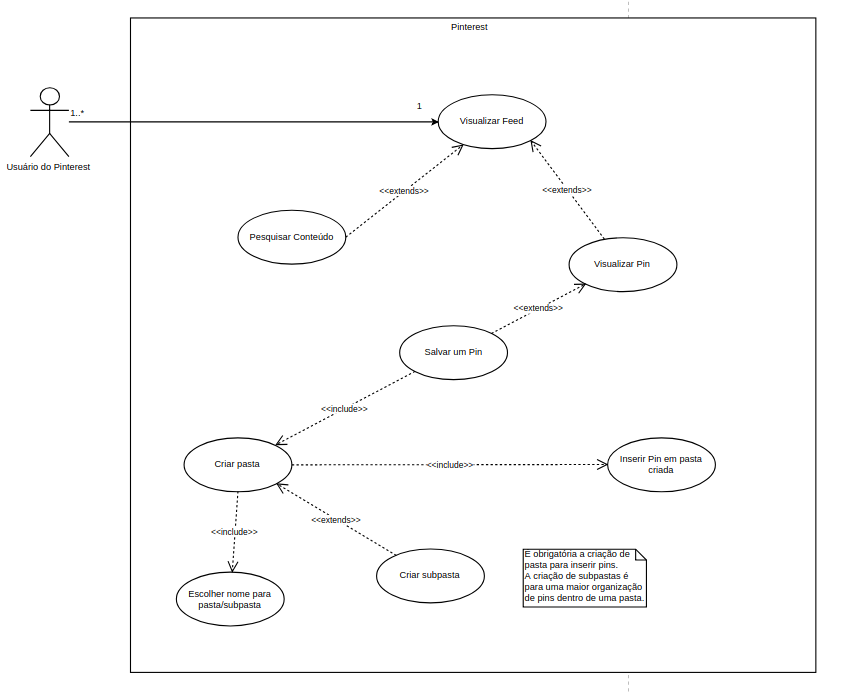
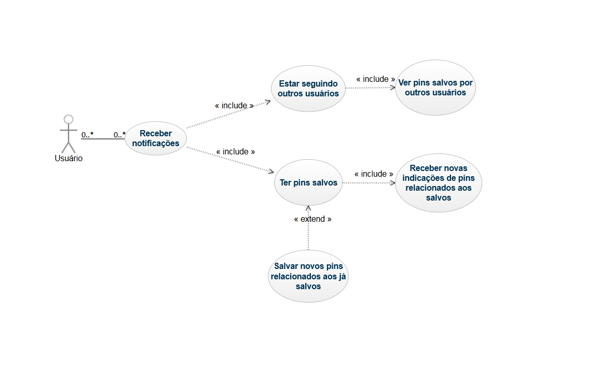
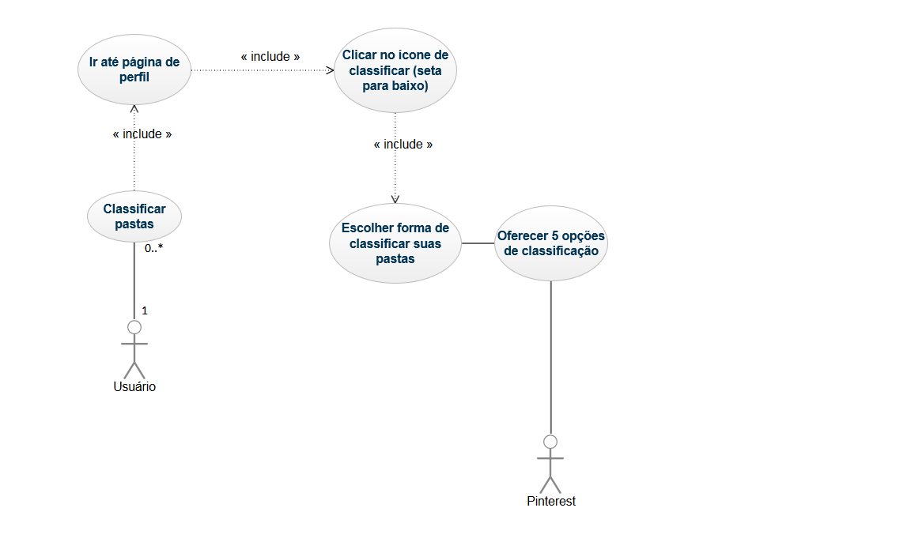
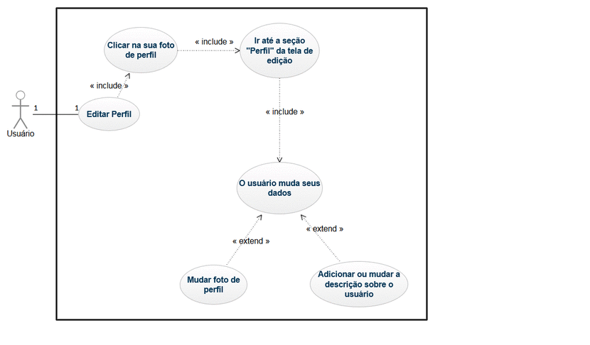

# Introdução

## DCU 1

### **Enviar mensagem**

[especificação de caso de uso: ECU 10 ](especificacoes_caso_uso.md#ecu-10)

## DCU 2

### **Cadastro de usuário**

[especificação de caso de uso: ECU 1 ](especificacoes_caso_uso.md#ecu-1)

## DCU 3

### **Visualizar pin**

[especificação de caso de uso: ECU 2 ](especificacoes_caso_uso.md#ecu-2)

## DCU 4

### **Comentar em um Pin**

[especificação de caso de uso: ECU 3 ](especificacoes_caso_uso.md#ecu-3)

## DCU 5

### **Compartilhar Pasta**

[especificação de caso de uso: ECU 25 ](especificacoes_caso_uso.md#ecu-25)

## DCU 6

### **Criar Pasta**

[especificação de caso de uso: ECU 26 ](especificacoes_caso_uso.md#ecu-26)

## DCU 7

### **Definir interesses**

[especificação de caso de uso: ECU 4 ](especificacoes_caso_uso.md#ecu-4)

## DCU 8

### **Editar um Pin**

[especificação de caso de uso: ECU 5 ](especificacoes_caso_uso.md#ecu-5)

## DCU 9

### **Enviar um Pin**

[especificação de caso de uso: ECU 13 ](especificacoes_caso_uso.md#ecu-13)

#### Versão 1.0

#### Versão 2.0

## DCU 10

### **Realizar Primeiro login**

[especificação de caso de uso: ECU 14 ](especificacoes_caso_uso.md#ecu-14)

#### Versão 1.0

#### Versão 2.0

## DCU 11

### **Fazer login**

[especificação de caso de uso: ECU 6 ](especificacoes_caso_uso.md#ecu-6)

## DCU 12

### **Ir para a fonte de um Pin**

[especificação de caso de uso: ECU 7 ](especificacoes_caso_uso.md#ecu-7)

## DCU 13

### **Organizar Pasta**

[especificação de caso de uso: ECU 22 ](especificacoes_caso_uso.md#ecu-22)

## DCU 14

### **Pesquisar por tema**

[especificação de caso de uso: ECU 23 ](especificacoes_caso_uso.md#ecu-23)

## DCU 15

### **Pesquisar por foto**

[especificação de caso de uso: ECU 24 ](especificacoes_caso_uso.md#ecu-24)

## DCU 16

### **Seguir outro usuário**

[especificação de caso de uso: ECU 8 ](especificacoes_caso_uso.md#ecu-8)

## DCU 17

### **Salvar um Pin**

[especificação de caso de uso: ECU 12 ](especificacoes_caso_uso.md#ecu-12)

#### Versão 1.0

#### Versão 2.0

## DCU 18

### **Visualizar Feed**

[especificação de caso de uso: ECU 19 ](especificacoes_caso_uso.md#ecu-19)

## DCU 19

### **Visualizar aba Seguindo**

[especificação de caso de uso: ECU 9 ](especificacoes_caso_uso.md#ecu-9)

## DCU 20

### **Receber notificações**

[especificação de caso de uso: ECU 20 ](especificacoes_caso_uso.md#ecu-20)

## DCU 21

### **Classificar Pastas**

[especificação de caso de uso: ECU 21 ](especificacoes_caso_uso.md#ecu-21)

## DCU 22

### **Ocultar um Pin**

[especificação de caso de uso: ECU 11 ](especificacoes_caso_uso.md#ecu-11)

## DCU 23

### **Denunciar um Pin**

[especificação de caso de uso: ECU 16 ](especificacoes_caso_uso.md#ecu-16)

## DCU 24

### **Classificar um Pin como Experimentado**

[especificação de caso de uso: ECU 17 ](especificacoes_caso_uso.md#ecu-17)

## DCU 25

### **Sair do aplicativo Pinterest**

[especificação de caso de uso: ECU 15 ](especificacoes_caso_uso.md#ecu-15)

## DCU 26

### **Editar Perfil**

[especificação de caso de uso: ECU 18 ](especificacoes_caso_uso.md#ecu-18)

