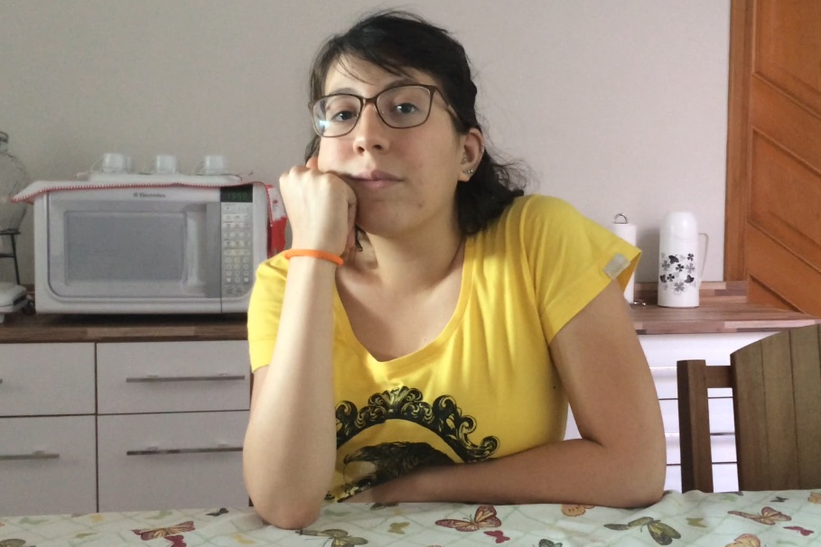

# Entrevista

Essa técnica consiste na formulação de perguntas que são filtradas e propostas aos interessados no intuito de, por meio das respostas, elicitar requisitos. A Técnica permite um bom contato com diferentes experiências, bem como a análise do aplicativo em questão por pontos de vistas diferentes e que suscitam funcionalidades e aspectos únicos conforme a perspectiva, ainda que subjetiva, do interessado entrevistado. Existem duas formas de entrevistas utilizadas em formas de elicitação:

* A **Entrevista Fechada**, que consiste na proposição de perguntas estritamente pré-formuladas e em respostas conforme especificação.

* A **Entrevista Aberta**, em que o roteiro de perguntas predefinidas é adaptado conforme o entrevistador identifica a oportunidade de elicitação de mais requisitos ao abordar um outro tópico ou pergunta.

### Rastreabilidade

| Nome | Papel | Observação |
|--|--|--|
| Alexandre Miguel | Entrevistador | Membro da equipe |
| Fernanda dos Santos | Entrevistada | Usuária do aplicativo |

### Metodologia

Essa entrevista foi realizada com Fernanda dos Santos, estudante de Design na _Universidade de Brasília_. A Técnica de entrevista utilizada foi a de **Entrevista Aberta**, permitindo que novos processos, bem como o detalhamento de algumas funcionalidades pudessem ser melhor exploradas, conforme foi identificada possibilidade de elicitação de diferentes requisitos. A Estudante foi escolhida por declarar uso constante do aplicativo em diferentes atividades, tanto no que se refere a pesquisas pessoais quanto a pesquisas voltadas para tópicos acadêmicos.

### Roteiro     

 * **Quais funcionalidades você mais utiliza no Pinterest?**
 * **Por qual motivo utilizar o Pinterest ainda que outros aplicativos tenham funcionalidades semelhantes?**
 * **Existe alguma funcionalidade que você não gosta ou acha que poderia melhorar?**
 * **Qual o principal motivo para que você utilize o Pinterest?**
 * **O Feed do Pinterest sugere temas congruentes com suas pesquisas?**

### Resumo da Entrevista

_A Seguinte transcrição foi editada para maior clareza das informações discutidas, a entrevista completa encontra-se disponível [nesse link](https://www.youtube.com/watch?v=1qWvLpRLVLQ)._

** Entrevistador - Alexandre Miguel  : Fernanda, quais são as funcionalidades que você mais utiliza no apicativo? **

 ** _Fernanda dos Santos_ - ** Eu uso muito os recursos das pastas para salvar referências gerais, principalmente para projetos em que estou participando. Então, geralmente eu construo uma pasta que tenha a ver com esse projeto, como um Boarding de imagens para construir novas coisas em cima dessas ideias. Geralmente eu uso muito o recurso das pesquisas do Pinterest, uso muito as subpastas, algo implementado recentemente e que eu acho muito útil.

** Por quê? **

 Porque se consegue estratificar ainda mais a pesquisa. Por exemplo, se eu tenho uma pasta sobre moda, e consigo ter várias referências internas como maquiagem, alta costura e etc. Isso possibilita maior separação sem precisar criar tantas pastas, afinal está tudo dentro de um mesmo conceito.

** O Que faz você continuar usando o Pinterest, dado que o aplicativo não é tão novo e existem outros, atualmente, que competem em termos de funcionalidades, como o Instagram? **

 Eu não gosto do recurso de pastas que o Instagram implementou, porque o Instagram não possibilita salvar ou inserir imagens em documentos, como slides ou arquivos, pelo próprio aplicativo, algo presente no Pinterest. Confesso não conhecer outros aplicativos com funcionalidades semelhantes como a organização de imagens em pastas. Mas o Pinterest é mais prático nesses aspectos, principalmente porque a maioria das pessoas com quem eu trabalho já utilizam o Pinterest, então se eu precisar criar uma pasta colaborativa, é só adicioná-las.

** Como funcionam essas pastas colaborativas? **

 Você cria uma pasta, como num projeto em que eu estava participando de um curta em que a gente construiu uma pasta geral do curta com subdivisões como direção de arte, fotografia e etc. E todo mundo que estava participando do curta foi adicionado nessa pasta e poderia colocar novas referências.

** Vocês usavam o sistema de mensagens do Pinterest? **

 Não, eu nem sabia que existia.

** Tem alguma outra funcionalidade que você não gosta no Pinterest? Que você critica ou acha que poderia melhorar? **

 Eu acho o aplicativo ruim, pra ser sincera. Acho tanto a versão web quanto a do aplicativo ruins, sendo que a da web é totalmente antiprática, como se apenas tivessem pegado a interface do celular e expandido e isso não funciona, basicamente eu só utilizo quando quero salvar imagens mais rapidamente ou vê-las em tamanho maior. Embora eu utilize a extensão do Google Chrome do Pinterest, essa realmente funciona!

** Como a extensão funciona? **

 Se você estiver no Facebook e você gostou de uma imagem, quando você passa o _mouse_ por essa imagem, já aparece uma opção de salvar no Pinterest e, ao clicar nessa opção, abre um _pop-up_ mostrando as pastas que você tem no Pinterest e qual você quer salvar, mesmo que a imagem não esteja no Pinterest. Sobre o funcionamento do aplicativo, ele é muito melhor, mas ele tem alguns defeitos principalmente na organização de pastas e subpastas, que acaba sendo um processo muito burocrático, como quando você quer transferir um Pin de uma pasta para uma subpasta dentro de uma pasta diferente, esse processo não é direto, você tem que transferir entre pastas para depois organizar a pasta que está recebendo o Pin e aí salvar o Pin no local correto.

 Um outro problema é a pesquisa do Pinterest, que às vezes acaba trazendo conteúdos indesejados, como quando se está pesquisando referências anatômicas e acaba sendo sugerindo pornografia depois. É horrível. O Bom é que o aplicativo pode te ajudar, pois ele tem a opção de não te mostrar mais esse tipo de conteúdo, depois que ele te mostrou aquilo 20 vezes e você censurou todas elas, ele acaba entendendo.

** Então a função de parar mostrar um tipo de conteúdo funciona, porém você deve bloquear várias vezes o conteúdo? **

 Sim! É uma situação bem ruim e pode ser até constrangedora, mas acho que os outros usuários entendem pois é normal isso acontecer.

**  Você utiliza o Pinterest mais em que contexto? É uma usuária casual? Usa pra trabalho? Faculdade? **

 Eu uso muito para projetos que eu estou participando, como quando vou fazer um curta e precisamos de uma coleção, além dos meus projetos pessoais e referências artísticas. É muito bom para quando você quer classificar certos períodos históricos, pois as informações ficam mais organizadas e é mais fácil encontrar quando se precisa de um dado.

** Você acha que a funcionalidade de explorar o Feed funciona bem? Acha que faz sugestões legais e quando você delimita um tema, ele te mostra realmente o que você pesquisou? Já ocorreu de alguma vez o Pinterest sugerir algo que você estava pesquisando por fora? **

 Nunca ocorreu do app sugerir algo que eu estivesse pesquisando por fora. Mas, geralmente, quando eu faço uma pesquisa mais aprofundada em um tema, o explorar meu feed fica meio enviezado, aparecendo com mais frequência do que temas que eu tinha explorado anteriormente. Mas no geral meu feed já é bem enviezado para alguns temas em específico.

** Você acha interessante o aplicativo já te mostrar assuntos de tendências de pesquisas suas no próprio feed? **

 Eu acho interessante até que costuma chegar em um ponto em que o aplicativo começa a me mostrar as mesmas imagens ou coisas que eu já tinha visto e descartado.

### Requisitos Elicitados

Os seguintes elicitos foram obtidos de acordo com os temas abordados durante a entrevista.

#### Requisitos Funcionais

| Código | Descrição | Finalidade | Prioridade |
|--|--|--|--|
| ENT1 | O app deve reunir os pins salvos pelo usuário em pastas. |  Possibilitar ao usuário uma organização de Pins conforme afinidade de temas.| Must |
| ENT2 | O app deve possibilitar a criação de subpastas internas às pastas de um tema. | Organizar Pins de subtemas pertencentes a uma mesma temática. | Should |
| ENT3 | O app deve possuir a função de compartilhar a edição de pastas com usuários. |  Permitir a construção de uma pasta colaborativa para a reunião de ainda mais Pins de um mesmo tema. | Could |
| ENT4 | O app deve possuir uma barra para pesquisa de temas. | Permitir que usuário encontre Pins de seu interesse de maneira mais direte. | Must |
| ENT5 | O app deve possuir um design de interface semelhante entre o aplicativo mobile e o aplicativo web. | Garantir que o usuário não terá problemas de utilização caso troque de plataforma. | Should |
| ENT6 | O app deve possuir uma extensão para navegadores web. | Propiciar ao usuário um meio de pesquisa com maior tamanho de tela e próximo de diferentes ambientes virtuais. | Could |
| ENT7 | A Extensão para navegador deve permitir salvar imagens de outros sites em pastas do usuário no app.| Para que o usuário possa reunir diferentes imagens, não restringindo o espaço amostral aos Pins postados no Pinterest | Could |
| ENT8 | A Extensão para navegador deve informar ao usuário sobre a possibilidade de salvar a imagem no Pinterest. | Garantir que o usuário seja informado de uma funcionalidade atuante como diferencial do aplicatvo. | Would |
| ENT9 | A Extensão para navegador deve permitir que o usuário escolha a pasta em que será salva uma imagem de outro website. | Permitir a organização dos conteúdos pelo usuário. | Must |
| ENT10 | O App deve possibilitar que o usuário reorganize os Pins salvos em diferentes subpastas. | Permitir que o usuário personifique suas pastas da forma mais conveniente.| Should |
| ENT11 | O App deve possibilitar a transferência de Pins entre pastas. | Permitir que o usuário possa reorganizar seus Pins salvos. | Must |
| ENT12 | O App deve sugerir Pins sobre assuntos pesquisados recentemente pelo usuário. | Auxiliar na busca do usuário por Pins semelhantes e sugerir novos Pins do tema que o usuário possui interesse. | Should |
| ENT13 | O App deve permitir que o usuário impeça que determinado tipo de conteúdo seja mostrado como sugestão. | Impedir que o usuário receba conteúdo que não é de seu interesse. | Must |
| ENT14 | O Feed do aplicativo deve ser embasado em Pins salvos pelo usuário. | Garantir que o usuário receba sugestões baseadas em seus gostos já definidos.| Should |
| ENT15 | O App deve obter vários dados de Pins bloqueados que permitam identificar com precisão o tipo de conteúdo que o usuário não deseja visualizar.| Garantir que o usuário não veja mais Pins de um tipo específico, sem retirar conteúdos de interesse do usuário. | Must |
