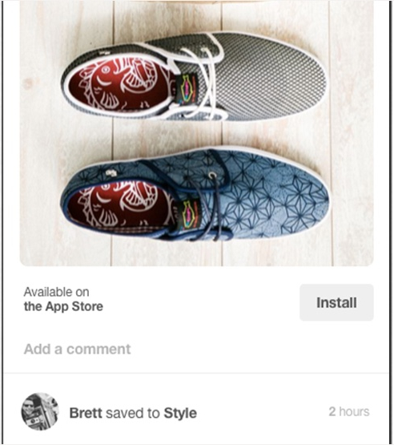
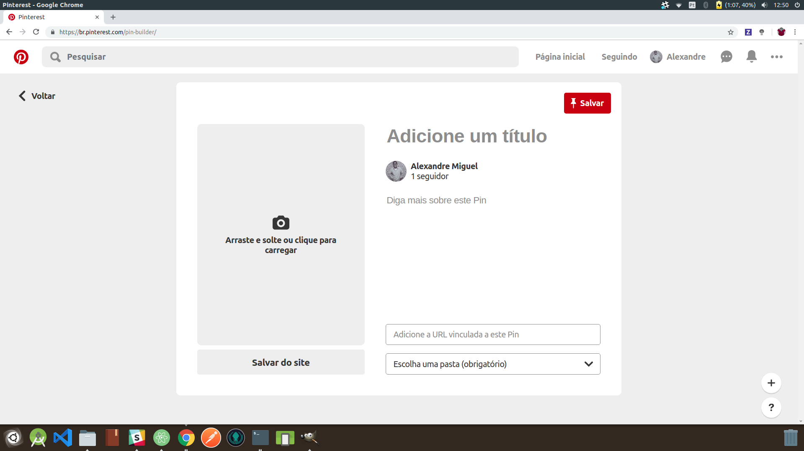

# Introdução

Este artefato busca ligar cada funcionalidade do Pinterest, aqui demonstradas por meio de *print screens* do aplicativo, aos seus respectivos requisitos.

# Forward-From

## Tabela de Requisitos Funcionais

|  Código | Descrição | Funcionalidade |
|  :------: | :------: | :------: |
|  RF1 | O app deve apresentar opções de micro-serviço (Facebook ou Google) e e-mail como forma de login e cadastro. | [IMG01](forward_from.md#img01-login) |
|  RF2 | O app deve ter um feed baseado nos interesses do usuário. | [IMG02](forward_from.md#img02-feed) |
|  RF3 | Manter os interesses do usuário. | [IMG03](forward_from.md#img03) |
|  RF4 | O usuário deve ter a opção de salvar pins em um pasta | [IMG04](forward_from.md#img04) |
|  RF5 | O app deve possuir uma barra para pesquisa por texto. | [IMG05](forward_from.md#img05) |
|  RF6 | O App deve possibilitar a transferência de Pins entre pastas. | [IMG06](forward_from.md#img06) |
|  RF7 | O App deve permitir que o usuário impeça que determinado tipo de conteúdo seja mostrado em seu feed. | [IMG07](forward_from.md#img07) |
|  RF8 | O App deve obter vários dados de Pins bloqueados para identificar com precisão o tipo de conteúdo que o usuário não deseja visualizar. | [IMG08](forward_from.md#img08) |
|  RF9 | O app deve absorver a informação das categorias dos pins mais visualizados para usar nas próximas recomendações | [IMG09](forward_from.md#img09) |
|  RF10 | O app deve separar os pins por categorias | [IMG10](forward_from.md#img10) |
|  RF11 | O usuário deve ter a opção de avaliar pins e essa avaliação deve ser aberta a outros usuários | [IMG11](forward_from.md#img11) |
|  RF12 | O App deve possibilitar que o usuário reorganize os Pins salvos em diferentes subpastas. | [IMG12](forward_from.md#img12) |
|  RF13 | Ao clicar no pin o usuário deve conseguir ver mais informações sobre ele, como uma pequena ou grande descrição | [IMG13](forward_from.md#img13) |
|  RF14 | O usuário deve poder alterar seus interesses a qualquer momento. | [IMG14](forward_from.md#img14) |
|  RF15 | O usuário deve poder salvar seus pins no seu dispositivo | [IMG15](forward_from.md#img15) |
|  RF16 | Manter pastas. | [IMG16](forward_from.md#img16) |
|  RF17 | Manter subpastas. | [IMG17](forward_from.md#img17) |
|  RF18 | A plataforma deve disponibilizar uma forma de pesquisa por imagem. | [IMG20](forward_from.md#img18) |
|  RF19 | O usuário deve poder ser redirecionado para o link da imagem de um pin, caso haja um. | [IMG20](forward_from.md#img19) |
|  RF20 | O usuário deve conseguir compartilhar pins com outros usuários | [IMG20](forward_from.md#img20-21) |
|  RF21 | O usuário deve conseguir compartilhar pins em redes sociais | [IMG21](forward_from.md#img20-21) |
|  RF22 | A aplicação deve colocar nos pins a opção de "comentários" | [IMG22](forward_from.md#img22) |
|  RF23 | O Pinterest deve oferecer a opção de seguir usuários | [IMG23](forward_from.md#img23) |
|  RF24 | O usuário deve poder ocultar e denunciar pins. | [IMG24](forward_from.md#img24) |
|  RF25 | O aplicativo deve apresentar um navegador interno para redirecionamento de links presentes em pins. | [IMG25](forward_from.md#img25) |
|  RF26 | O app deve possuir a função de compartilhar a edição de pastas com outros usuários. | [IMG26](forward_from.md#img26) |
|  RF27 | As receitas devem ser pins especiais que ofereçam tempo, porções e ingredientes para instigar o usuário a fazê-la. | [IMG27](forward_from.md#img27) |
|  RF28 | O Aplicativo deve ser capaz de extrapolar dados de pesquisa de outras fontes para trazer itens mais relevantes para o usuário. | [IMG28](forward_from.md#img28) |
|  RF29 | O usuário deve poder enviar mensagem para outros usuários. | [IMG29](forward_from.md#img29)  |
|  RF30 | O usuário deve receber notificações sobre novidades no app. | [IMG30](forward_from.md#img30)  |
|  RF31 | O usuário deve poder editar seu perfil. | [IMG31](forward_from.md#img31)  |
|  RF32 | Os pins que se referem a artigos devem mostrar seu autor e descrição. | [IMG32](forward_from.md#img32) |
|  RF33 | Os pins que se referem a aplicativos devem mostrar a opção de instalar. | [IMG33](forward_from.md#img33) |
|  RF34 | O Usuário deve poder retirar e adicionar interesses após realizar o cadastro, acessando essa opção na aba de perfil | - |
|  RF35 | O Usuário deve possuir mais de uma opção de formas de ordenação das pastas na página de perfil, como ordem alfabética, últimos salvos, mais antigas, mais recentes ou pelo arraste dos elementos. | [IMG35](forward_from.md#img35) |
|  RF36 | O Pinterest deve notificar usuários de outros usuários com interesses semelhantes | [IMG36](forward_from.md#img36) |
|  RF37 | O Usuário deve poder ocultar seu perfil e seus dados de mecanismos de pesquisa | [IMG37](forward_from.md#img37) |
|  RF38 | O Pinterest deve poder utilizar dados, como cookies, para identificar informações de perfil do usuário e direcionar recomendações de pins | [IMG38](forward_from.md#img38) |
|  RF39 | O Usuário deve poder definir informações pessoais, como seu gênero, nome de usuário, imagem de perfil e descrição, por meio de uma opção ao editar perfil ou se cadastrar | [IMG39](forward_from.md#img39) |
|  RF40 | O Usuário deve poder definir em qual língua irá utilizar o aplicativo, seja na edição do perfil ou no cadastro | [IMG40](forward_from.md#img40) |
|  RF41 | O Usuário deve poder postar e editar posteriormente um Pin | [IMG41](forward_from.md#img41) |
|  RF42 | O Usuário deve poder postar pins a partir de imagens da galeria do dispositivo | [IMG42](forward_from.md#img42) |
|  RF43 | O Usuário deve definir informações do pin postado, como categorias, título e descrição | [IMG43](forward_from.md#img43) |
|  RF44 | O pinterest deve possuir interação fluida entre as funcionalidades, de modo que em poucos clique a ação seja feita. | - |
|  RF45 | O pinterest deve manter algum canal de comunicação com usuário no caso de dúvidas ou problemas ocorridos com o usuário. | [IMG45](forward_from.md#img45) |

## Imagens

### IMG01 - Login

| Versão Mobile | Versão Web |
|---|---|
|| |

### IMG02 - Feed

| Versão Mobile | Versão Web |
|---|---|
| - |   - |

### IMG03

| Versão Mobile | Versão Web |
|---|---|
|| |

### IMG04

| Versão Mobile | Versão Web |
|---|---|
|| |

### IMG05

| Versão Mobile | Versão Web |
|---|---|
|| |

### IMG06

| Versão Mobile | Versão Web |
|---|---|
|| |

### IMG07

| Versão Mobile | Versão Web |
|---|---|
|| |

### IMG08

| Versão Mobile | Versão Web |
|---|---|
||   |

### IMG09

| Versão Mobile | Versão Web |
|---|---|
|  |  |

### IMG10

| Versão Mobile | Versão Web |
|---|---|
|| |

### IMG11

| Versão Mobile | Versão Web |
|---|---|
| |  |

#### IMG12

| Versão Mobile | Versão Web |
|---|---|
||  |

#### IMG13
| Versão Mobile | Versão Web |
|---|---|
||  |

#### IMG14
| Versão Mobile | Versão Web |
|---|---|
||  |

#### IMG15
| Versão Mobile | Versão Web |
|---|---|
|  |   |

#### IMG16
| Versão Mobile | Versão Web |
|---|---|
||  |

#### IMG17
| Versão Mobile | Versão Web |
|---|---|
||  |

#### IMG18
| Versão Mobile | Versão Web |
|---|---|
|  -  |  -  |

#### IMG19
link para acesso: https://pin.it/sdi4d5gzapervm

| Versão Mobile | Versão Web |
|---|---|
|  |  |

### IMG20 - 21
| Versão Mobile | Versão Web |
|---|---|
||  |

### IMG22
| Versão Mobile | Versão Web |
|---|---|
||   |

### IMG23
| Versão Mobile | Versão Web |
|---|---|
||   |

### IMG24
| Versão Mobile | Versão Web |
|---|---|
||   |

### IMG25
| Versão Mobile | Versão Web |
|---|---|
|| Não disponível |

### IMG26
| Versão Mobile | Versão Web |
|---|---|
||  |

### IMG27
| Versão Mobile | Versão Web |
|---|---|
||   |

### IMG28
| Versão Mobile | Versão Web |
|---|---|
|  |   |

### IMG29
| Versão Mobile | Versão Web |
|---|---|
||  |

### IMG30
| Versão Mobile | Versão Web |
|---|---|
|  |  |

### IMG31
| Versão Mobile | Versão Web |
|---|---|
||  |

### IMG32
| Versão Mobile | Versão Web |
|---|---|
||  |

### IMG33
| Versão Mobile | Versão Web |
|---|---|
|| Não Disponível |

### IMG35
| Versão Mobile | Versão Web |
|---|---|
||  |

### IMG36
| Versão Mobile | Versão Web |
|---|---|
|Aguardando Notificação| Aguardando notificação|

### IMG37
| Versão Mobile | Versão Web |
|---|---|
||   |

### IMG38
| Versão Mobile | Versão Web |
|---|---|
||   |

### IMG39
| Versão Mobile | Versão Web |
|---|---|
| - |  -  |

### IMG40
| Versão Mobile | Versão Web |
|---|---|
||  |

### IMG41
| Versão Mobile | Versão Web |
|---|---|
|| |

### IMG43
| Versão Mobile | Versão Web |
|---|---|
|| |

### IMG45
| Versão Mobile | Versão Web |
|---|---|
|| |

### IMG46
| Versão Mobile | Versão Web |
|---|---|
|| x |
