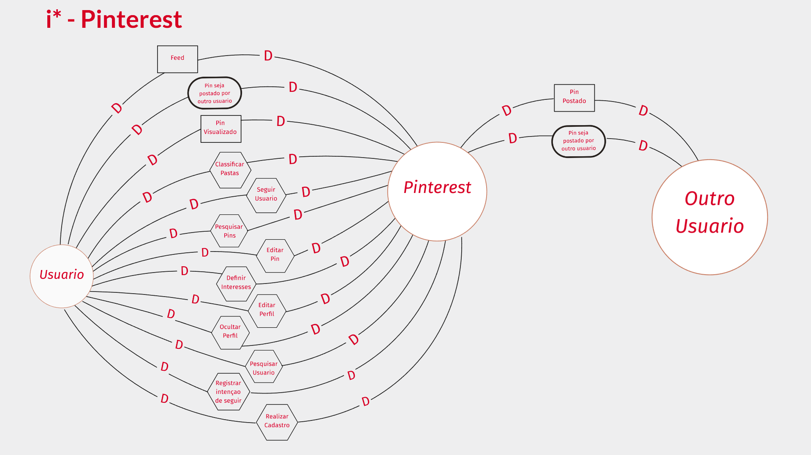
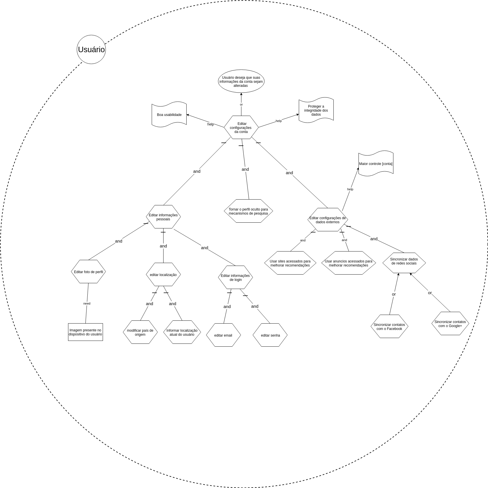
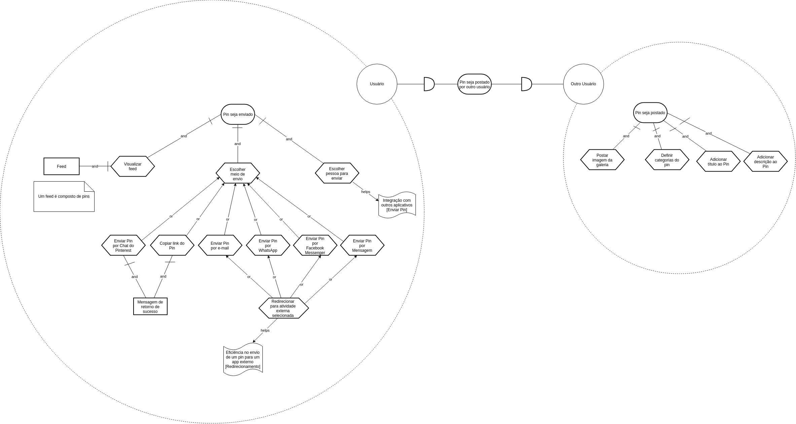

# Versionamento

|  Versão | Data | Modificação | Autor |
|  :------: | :------: | :------: | :------: |
|  1.0 | 23/10/2018 | Adição da primeira versão do  [IS1](#is1-definir-interesses) | Geovana Ramos |
|  1.1 | 23/10/2018 | Adição da primeira versão do diagrama de dependências *SD1.1* com foco no pin | Geovana Ramos |
|  1.2 | 24/10/2018 | Adição da primeira versão do diagrama de dependências *SD1.2* com foco nas pastas | Gabriela Medeiros |
|  1.3 | 24/10/2018 | Adição da primeira versão do  [IS2](#is2-classificar-pastas) | Letícia Meneses |
|  1.4 | 24/10/2018 | Adição da primeira versão do  [IS4](#is4-seguir-usuario) | Guilherme Guy |
|  1.5 | 24/10/2018 | Adição da primeira versão do  [IS3](#is3-pesquisar-pins) | Alexandre Miguel |
|  1.6 | 24/10/2018 | Adição da primeira versão dos  [IS7](#is7-usuario) e [IS8](#is8-outro-usuario) mesclados no mesmo diagrama | Daniel Maike |
|  2.0 | 26/10/2018 | Adição da segunda versão do  [IS4](#is4-seguir-usuario) | Guilherme Guy |
|  2.1 | 27/10/2018 | Adição da primeira versão do diagrama de dependências *SD2.1* com foco nas pastas | Gabriela Medeiros |
|  2.2 | 28/10/2018 | Adição da primeira versão do [IS5](#is5-editar-configuracoes-de-conta) | Joberth Rogers |
|  3.0 | 29/10/2018 | Adição da terceira versão do  [IS4](#is4-seguir-usuario) | Guilherme Guy |
|  3.1 | 29/10/2018 | Adição da segunda versão do  [IS2](#is2-classificar-pastas) | Letícia Meneses |
|  3.2 | 29/10/2018 | Adição da segunda versão dos  [IS7](#is7-usuario) e [IS8](#is8-outro-usuario), já separados e com softgoals | Daniel Maike |
|  3.3 | 29/10/2018 | Adição do [IS9](#is9-enviar-pin) tendo o contexto de enviar pin com o pinterest como ator | Daniel Maike |
|  3.4 | 29/10/2018 | Adição da segunda versão do [IS3](#is3-pesquisar-pins) | Alexandre Miguel |
|  3.5 | 29/10/2018 | Adição da primeira versão do [IS6](#is6-cadastro-no-pinterest) | Helena Goulart |
|  3.6 | 02/11/2018 | Adição do [IS10](#is10-geral) tendo uma análise mais ampla do pinterest como ator | Geovana Ramos e Joberth Rogers |
|  3.7 | 15/11/2018 | Adição do [IS11](#is11-retornar-pins) analisando o retorno de pesquisas na aplicação tendo o pinterest como ator | Alexandre Miguel |
|  3.8 | 15/11/2018 | Adição da terceira versão do  [IS3](#is3-pesquisar-pins) | Alexandre Miguel |

# Strategic Dependency Models

## Versão 1.0

### SD1.1 - Pin

### SD1.2 - Pastas

## Versão 2.0

### SD2.1 - Pastas

## Versão 3.0

### SD3.0 - Geral

# Strategic Rationale Models

# IS1 - Definir interesses

### Versão 1.0

### Versão 2.0

# IS2 - Classificar pastas

### Versão 1.0

### Versão 2.0

# IS3 - Pesquisar Pins

### Versão 1.0

### Versão 2.0

### Versão 3.0

# IS4 - Seguir usuário

### Versão 1.0

### Versão 2.0

### Versão 3.0

# IS5 - Editar configurações de conta

### Versão 1.0

### Versão 2.0

# IS6 - Cadastro no Pinterest

# Enviar Pin

### Versão 1.0

### Versão 2.0

# IS7 - Usuário

# IS8 - Outro Usuário

## Pinterest

# IS9 - Enviar Pin

# IS10 - Geral

# IS11 - Retornar Pins

