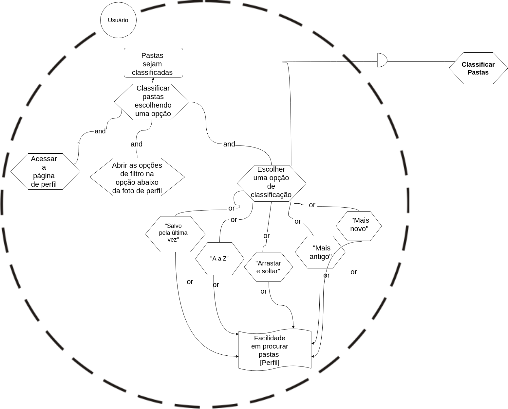
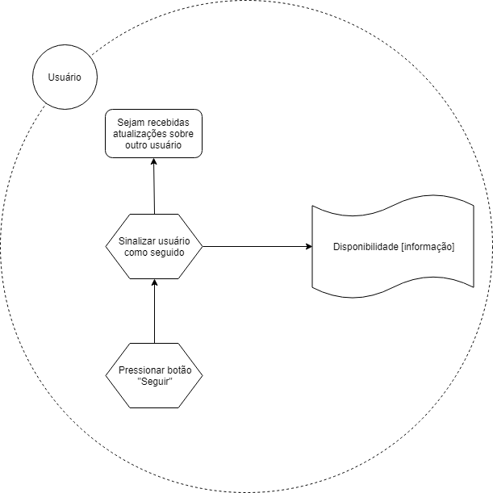

# Strategic Dependency Models

### Geral

# Strategic Rationale Models

## IS1 - Definir interesses

### Versão 1.0

### Versão 2.0

## IS2 - Classificar pastas

## IS3 - Pesquisar Pins

### Versão 1.0

### Versão 2.0

## IS4 - Seguir usuário

## IS5 - Editar configurações de conta

## IS6 - Cadastro no Pinterest

## Enviar Pin

## IS7 - Usuário

## IS8 - Outro Usuário

## Pinterest

## IS9 - Enviar Pin

## IS10 - Geral

## IS11 - Retornar Pins

