# Introdução

O presente documento visa apresentar a inspeção dos casos de uso, trabalho desenvolvido no módulo de Modelagem de Requisitos.

# Objetivo

A inspeção dos casos de uso permite conhecer vários aspectos sobre as informações, a abrangência, a completude, a qualidade do objeto analisado. Um dos focos principais desta inspeção é realizar a verificação da consistência técnica dos casos de uso levantados e também validar os casos de uso através de métricas. Esse conjunto de dados permite descobrir as fraquezas existentes no trabalho e facilita a melhoria da qualidade dos casos de uso nas métricas levantadas como passíveis de melhorias.

# Metodologia

Para a inspeção dos casos de uso será utilizada uma metodologia de avaliação padronizada, em que cada caso de uso, será julgado de acordo com sua não-conformidade com a métrica em análise, ou seja, se a opção “não” for marcada, quer dizer que a descrição de caso de uso não está em conformidade com a métrica. Cada métrica está disposta em uma escala de impacto, sendo este alto, médio ou baixo. Além disso, também há espaço para a adição de observações pelo avaliador, quando necessário. A inspeção será montada em forma de tabela, sendo cada tabela uma tabela de inspeção baseada no checklist geral criado para este documento, em que contém as métricas necessárias para avaliação de um caso de uso.

Após a aplicação da checklist na descrição de uma inspeção de um caso de uso selecionado será compilada a tabela de medição de inspeção. Em que é compilado um valor que representa de forma quantitativa a qualidade da descrição de caso de uso. A tabela de medição necessita de pesos para os impactos e neste trabalho será usado como convenção o peso 3 para métricas com alto impacto, 2 para impacto médio e 1 para impacto baixo. Nesta tabela é calculado a proporção de não conformidades encontradas, tendo como parâmetro de aceitação uma taxa máxima de 35% das questões aplicadas. Sendo que o resultado classificatório final é “Aprovado” quando a taxa de não conformidade é menor que a taxa máxima e “Reprovado” caso contrário.

As métricas utilizadas e a metodologia são elaboradas a partir do estudo “Uma proposta de inspeção em modelos de caso de uso” de Rosângela Gregolin [ [1] ](#referencias). Neste estudo a autora levanta critérios, regras e modelos para a melhor inspeção de casos de uso, tanto em formato de diagrama, quanto sua descrição.

A metodologia possui certas adaptações para melhor adequá-la ao contexto da disciplina, pois não é feito desenvolvimento de protótipos e documentos específicos requisitados pelo modelo.
Para uma melhor avaliação e observações das métricas foram utilizadas referenciais teóricos da IBM que auxiliam na produção de um bom caso de uso e com isso consegue-se visualizar melhor os erros cometidos no caso de uso desenvolvidos no projeto da matéria e elaborar melhores observações a respeito da métrica analisada.

A seguir pode-se conferir os modelos utilizados para a realização da inspeção:

### Checklist

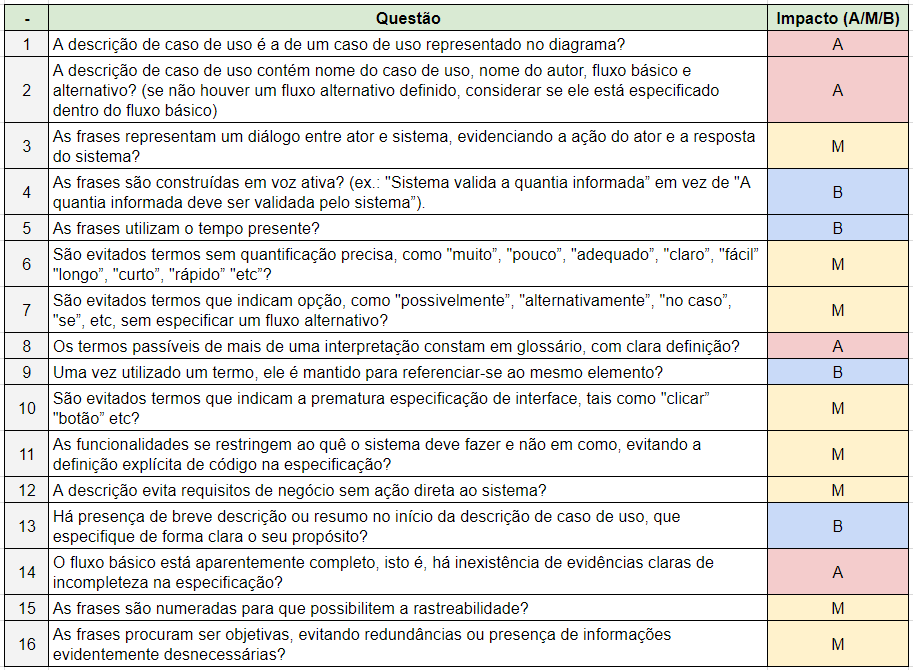

### Registro de Inspeção

### Tabela de medição

## Inspeções

### Relação de inspeções

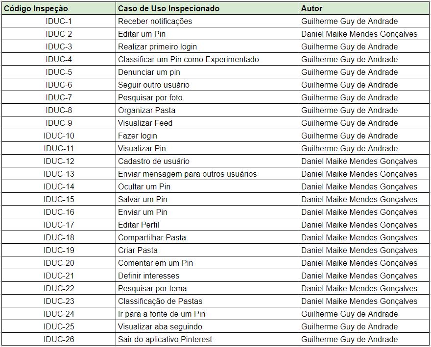

### IDUC-1 Receber Notificações

Rastreabilidade: [UC - Receber Notificações]()

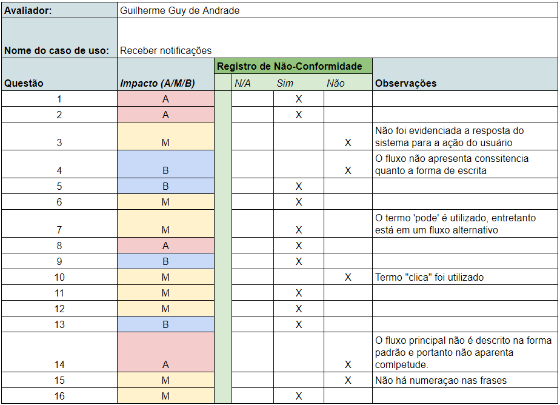

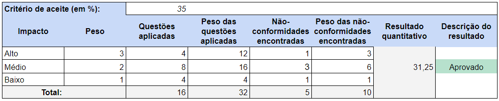

### IDUC-2 Editar um Pin

Rastreabilidade: [UC - Nome]()

### IDUC-3 Realizar primeiro login

Rastreabilidade: [UC - Nome]()

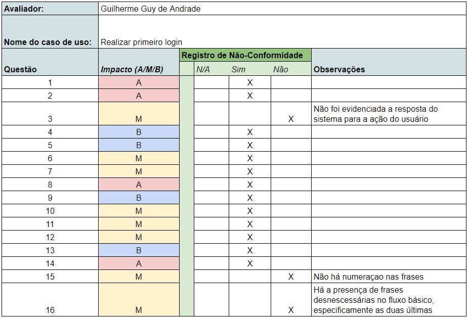

### IDUC-4 Classificar um Pin como Experimentado

Rastreabilidade: [UC - Nome]()

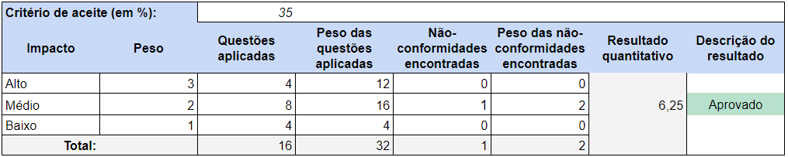

### IDUC-5 Denunciar um Pin

Rastreabilidade: [UC - Nome]()

### IDUC-6 Seguir outro usuário

Rastreabilidade: [UC - Nome]()

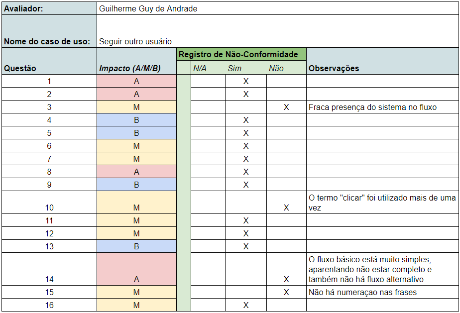

### IDUC-7 Pesquisar por foto

Rastreabilidade: [UC - Nome]()

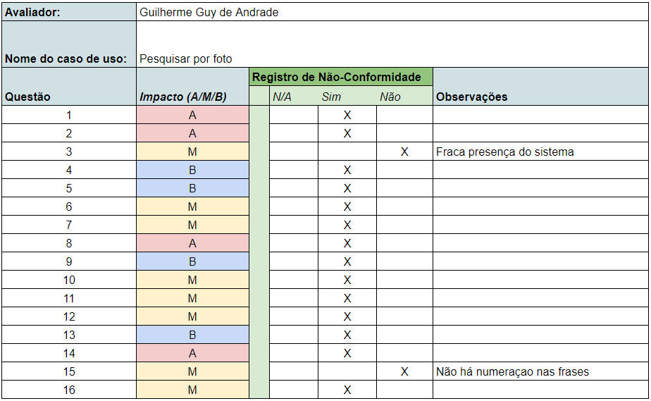

### IDUC-8 Organizar Pasta

Rastreabilidade: [UC - Nome]()

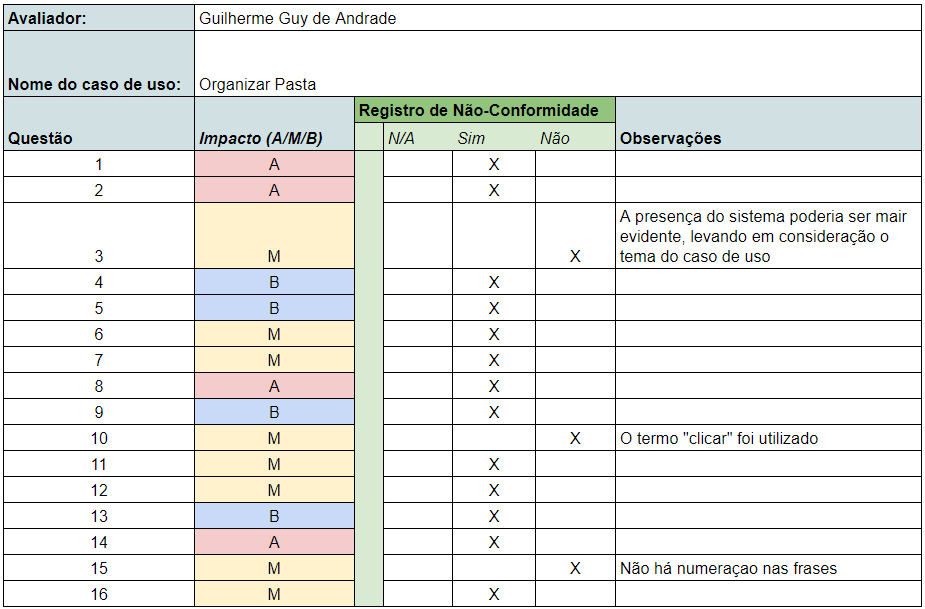

### IDUC-9 Visualizar Feed

Rastreabilidade: [UC - Nome]()

### IDUC-10 Fazer login

Rastreabilidade: [UC - Nome]()

### IDUC-11 Visualizar Pin

Rastreabilidade: [UC - Nome]()

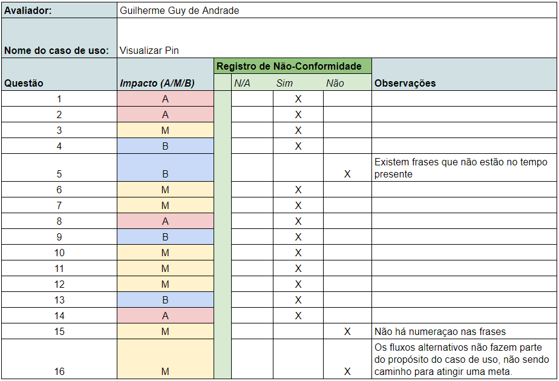

### IDUC-12 Cadastro de usuário

Rastreabilidade: [UC - Nome]()

### IDUC-13 Enviar mensagem para outros usuários

Rastreabilidade: [UC - Nome]()

### IDUC-14 Ocultar um Pin

Rastreabilidade: [UC - Nome]()

### IDUC-15 Salvar um Pin

Rastreabilidade: [UC - Nome]()

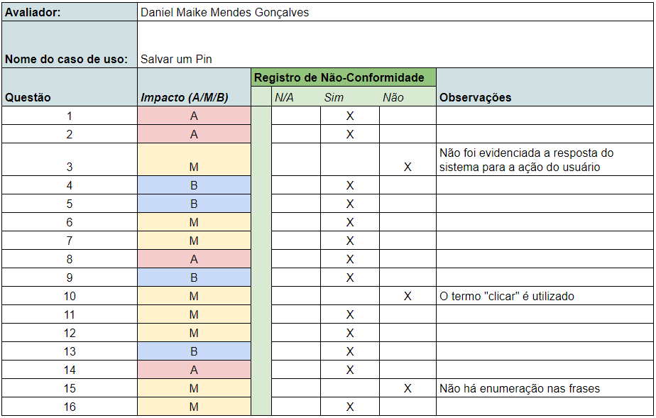

### IDUC-16 Enviar um Pin

Rastreabilidade: [UC - Nome]()

### IDUC-17 Editar Perfil

Rastreabilidade: [UC - Nome]()

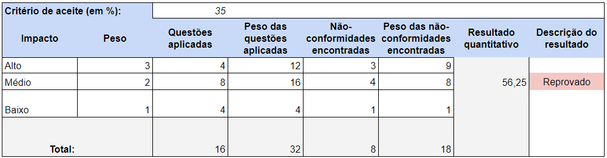

### IDUC-18 Compartilhar Pasta

Rastreabilidade: [UC - Nome]()

### IDUC-19 Criar Pasta

Rastreabilidade: [UC - Nome]()

### IDUC-20 Comentar em um Pin

Rastreabilidade: [UC - Nome]()

### IDUC-21 Definir interesses

Rastreabilidade: [UC - Nome]()

### IDUC-22 Pesquisar por tema

Rastreabilidade: [UC - Nome]()

### IDUC-23 Classificação de Pastas

Rastreabilidade: [UC - Nome]()

### IDUC-24 Ir para a fonte de um Pin

Rastreabilidade: [UC - Nome]()

### IDUC-25 Visualizar aba seguindo

Rastreabilidade: [UC - Nome]()

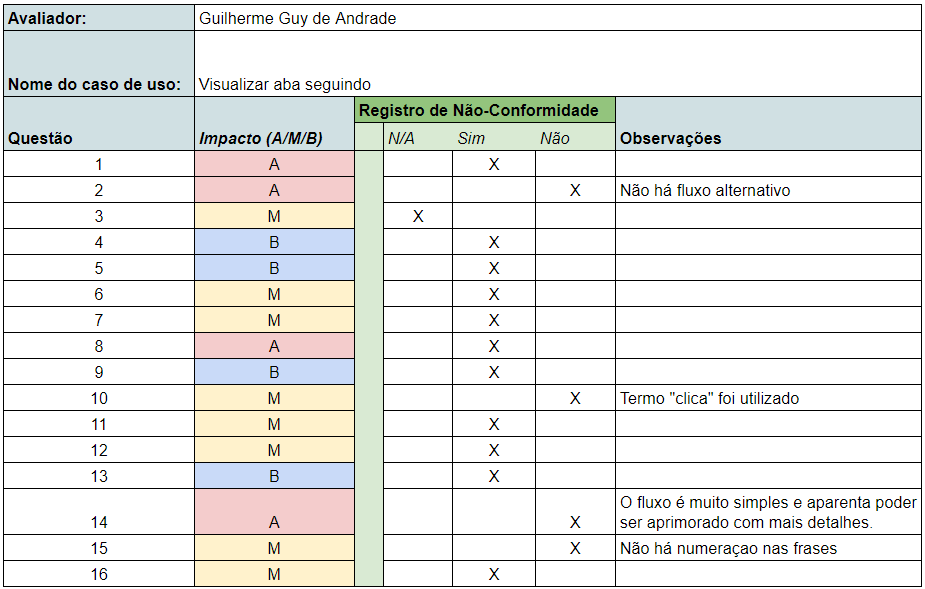

### IDUC-26 Sair do aplicativo Pinterest

Rastreabilidade: [UC - Nome]()

## Resultados

Com a realização da inspeção dos casos de uso foi verificado que todos eles possuem algum ponto em que precisam de melhoria, porém tivemos um resultado de 22 aprovados e 4 reprovados dentre os 26 casos de uso feitos pelo grupo no módulo de Modelagem de Requisitos.

## Conclusão

A inspeção dos casos de uso com base nos referenciais teóricos possibilitou a avaliação de métricas essenciais e a identificação de erros. Com as tabelas de inspeção, a correção de cada caso de uso será facilitada com os pontos fracos já listados.

## Referências

IBM. Creating use case. Disponível em: <https://www.ibm.com/support/knowledgecenter/SSB2MU_8.1.3/com.ibm.rhp.uml.diagrams.doc/topics/rhp_c_dm_use_case_diagrams.html>. Acesso em: 02 nov. 2018.

IBM. Use-cases. Disponível em: <https://www.ibm.com/developerworks/rational/library/content/RationalEdge/may02/m_chapter4_jr.pdf>. Acesso em: 02 nov. 2018.

IBM. Creating use case models. Disponível em: <https://www.ibm.com/support/knowledgecenter/SSB2MU_8.1.4/com.ibm.rhp.harmonyse.doc/topics/t_createusecases.htmll>. Acesso em: 02 nov. 2018.

Gregolin, Rosângela. Uma proposta de inspeção em modelos de caso de uso. 2007. Disponível em: <http://cassiopea.ipt.br/teses/2007_EC_Rosangela_Gregolin.pdf>. Acesso em: 01 nov. 2018.
