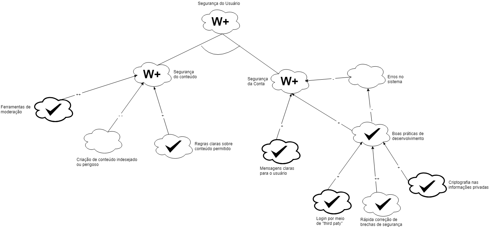

|  Versão | Data | Modificação | Autor |
|  :------: | :------: | :------: | :------: |
|  1.0 | 14/10/2018 | Adição da primeira versão do  [NFR1](#nfr1-confiabilidade) | Geovana Ramos |
|  1.1 | 15/10/2018 | Adição da primeira versão do  [NFR2](#nfr2-conectividade) | Alexandre Miguel |
|  1.2 | 16/10/2018 | Adição da primeira versão do  [NFR3](#nfr3-usabilidade) | Gabriela Medeiros |
|  1.3 | 16/10/2018 | Adição da primeira versão do  [NFR5](#nfr5-desempenho) | Joberth Rogers |
|  1.4 | 16/10/2018 | Adição da primeira versão do  [NFR6](#nfr6-suporte) | Daniel Maike |
|  1.5 | 17/10/2018 | Adição da primeira versão do [NFR8](#nfr8-suportabilidade) | Letícia Meneses |
|  1.6 | 17/10/2018 | Adição da primeira versão do [NFR7](#nfr7-seguranca) | Guilherme Guy |
|  1.7 | 17/10/2018 | Adição da primeira versão do  [NFR4](#nfr4-usabilidade-design) | Helena Goulart |
|  2.0 | 17/10/2018 | Adição da segunda versão do [NFR8](#nfr8-suportabilidade), após avaliação com os professores, com alteração nos impactos | Letícia Meneses |
|  2.1 | 17/10/2018 | Adição da segunda versão do  [NFR4](#nfr4-usabilidade-design), após avaliação com os professores, com alteração nos impactos | Helena Goulart |
|  2.2 | 17/10/2018 | Adição da segunda versão do  [NFR6](#nfr6-suporte), após avaliação com os professores, com reformulação das operacionalizações | Daniel Maike |
|  2.3 | 17/10/2018 | Adição da terceira versão do  [NFR6](#nfr6-suporte), com reconstrução do modelo no diagrama | Daniel Maike |
|  2.4 | 20/10/2018 | Adição da segunda versão do  [NFR1](#nfr1-confiabilidade), após avaliação com os professores, com reformulação das decomposições | Geovana Ramos |
|  2.5 | 20/10/2018 | Adição da segunda versão do [NFR7](#nfr7-seguranca), com novos níveis de decomposição | Guilherme Guy |
|  2.6 | 20/10/2018 | Adição da segunda versão do  [NFR5](#nfr5-desempenho), após avaliação dos professores, com adição de softgoals | Joberth Rogers |
|  2.7 | 13/11/2018 | Adição da segunda versão do  [NFR2](#nfr2-conectividade), após inserção de adaptabilidade | Alexandre Miguel |
|  3.0 | 16/11/2018 | Adição da terceira versão do [NFR7](#nfr7-seguranca), após análise do modelo | Guilherme Guy |
|  3.1 | 16/11/2018 | Adição da segunda versão do  [NFR3](#nfr3-usabilidade), após análise do modelo | Gabriela Medeiros |
|  3.2 | 17/11/2018 | Adição da terceira versão do  [NFR3](#nfr3-usabilidade), após análise do modelo | Gabriela Medeiros |
# NFR1 - Confiabilidade

### Versão 1.0

### Versão 2.0

# NFR2 - Conectividade

### Versão 1.0

### Versão 2.0

# NFR3 - Usabilidade

### Versão 1.0

### Versão 2.0

### Versão 3.0

# NFR4 - Usabilidade (Design)

### Versão 1.0

### Versão 2.0

# NFR5 - Desempenho

### Versão 1.0

### Versão 2.0

# NFR6 - Suporte

### Versão 1.0

### Versão 2.0

### Versão 3.0

# NFR7 - Segurança

### Versão 1.0

### Versão 2.0

### Versão 3.0 - Segurança e Qualidade de Conteúdo

Na versão 3.0 foi adicionado um olhar para a qualidade de conteúdo, além de melhorar o NFR anterior.

# NFR8 - Suportabilidade

### Versão 1.0

### Versão 2.0

