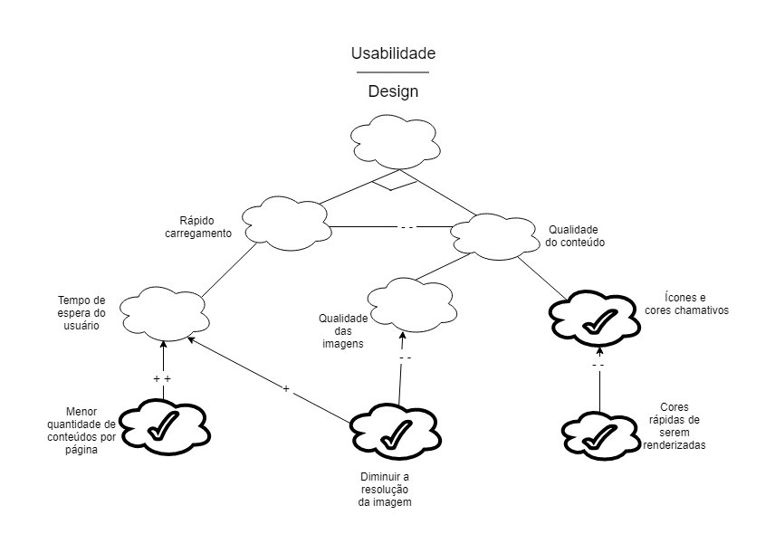

# NFR1 - Confiabilidade

# NFR2 - Conectividade

### Versão 1.0

### Versão 2.0

# NFR3 - Usabilidade

# NFR4 - Usabilidade (Design)

# NFR5 - Desempenho

# NFR6 - Suporte

# NFR7 - Segurança

# NFR8 - Suportabilidade

