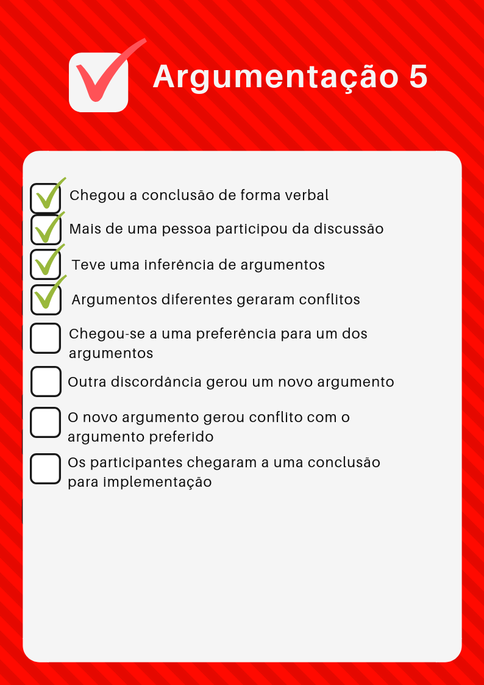

# Análise da Pré-rastreabilidade
Foram analisados todos os rich pictures e argumentações postadas neste repositório até a presente data (03/11/2018). O método utilizado foi uma checklist que possui pontos importantes para a implementação de um bom rich picture e uma boa argumentação. Estes pontos foram inferidos do material de aula de Requisitos de Software.

## Rich Picture

### Pin
| Número | Critério de sucesso | Sim/Não  | Melhorias |
|--|--|--|--|
| 1 | A simbologia está coerente? | S |  |
| 2 | Existe equilíbrio entre palavras e desenhos? | N | Os textos precisam completar mais aquilo que os ícones querem passar  |
| 3 | Os atores estão bem definidos? | N |Não fica bem definido quem pratica cada processo, apenas alguns possuem um ator  |
| 4 | O fluxo e as operações fazem sentido? | N | As setas poderiam ter uma descrição da ação |
| 5 | Possui operações suficientes para atender a proposta? | S |  |
| 6 | Usa linguagem compreensível? | S |  |
| 7 | Possui rastreabilidade? | N | Não indica de onde surgiram as operações |

### Pins Especiais
| Número | Critério de sucesso | Sim/Não  | Melhorias |
|--|--|--|--|
| 1 | A simbologia está coerente? | S |  |
| 2 | Existe equilíbrio entre palavras e desenhos? | N | Necessita de mais textos explicativos. |
| 3 | Os atores estão bem definidos? | N | Não ficou claro quem são os atores, poderia ter uma descrição em texto. |
| 4 | O fluxo e as operações fazem sentido? | N | Os itens ficaram "jogados" pela imagem, necessitando de mais operações para interligá-los |
| 5 | Possui operações suficientes para atender a proposta? | N |  |
| 6 | Usa linguagem compreensível? | S |  |
| 7 | Possui rastreabilidade? | S |  |

### Usuário
| Número | Critério de sucesso | Sim/Não  | Melhorias |
|--|--|--|--|
| 1 | A simbologia está coerente? | S |  |
| 2 | Existe equilíbrio entre palavras e desenhos? | S |  |
| 3 | Os atores estão bem definidos? | S |  |
| 4 | O fluxo e as operações fazem sentido? | S |  |
| 5 | Possui operações suficientes para atender a proposta? | N | Um usuário pode fazer muito mais dentro do sistema. Poderia ser quebrado em  vários rich pictures |
| 6 | Usa linguagem compreensível? | S |  |
| 7 | Possui rastreabilidade? | N |  Não indica de onde surgiram as operações |

### Pin
| Número | Critério de sucesso | Sim/Não  | Melhorias |
|--|--|--|--|
| 1 | A simbologia está coerente? | S |  |
| 2 | Existe equilíbrio entre palavras e desenhos? | N |  |
| 3 | Os atores estão bem definidos? | N |  |
| 4 | O fluxo e as operações fazem sentido? | N |  |
| 5 | Possui operações suficientes para atender a proposta? | S |  |
| 6 | Usa linguagem compreensível? | S |  |
| 7 | Possui rastreabilidade? | N |  Não indica de onde surgiram as operações |

## Aba Salvos
| Número | Critério de sucesso | Sim/Não  | Melhorias |
|--|--|--|--|
| 1 | A simbologia está coerente? | S |  |
| 2 | Existe equilíbrio entre palavras e desenhos? | N | Alguns ícones não possuem descrição e podem não ser intuitivos |
| 3 | Os atores estão bem definidos? | N | Deve explicitar o ator |

| 4 | O fluxo e as operações fazem sentido? | S |  |
| 5 | Possui operações suficientes para atender a proposta? | S |  |
| 6 | Usa linguagem compreensível? | S |  |
| 7 | Possui rastreabilidade? | N | Não indica de onde surgiram as operações |

### Usuário vendedor e usuário comum
| Número | Critério de sucesso | Sim/Não  | Melhorias |
|--|--|--|--|
| 1 | A simbologia está coerente? | S |  |
| 2 | Existe equilíbrio entre palavras e desenhos? | S |  |
| 3 | Os atores estão bem definidos? | S |  |
| 4 | O fluxo e as operações fazem sentido? | S |  |
| 5 | Possui operações suficientes para atender a proposta? | S |  |
| 6 | Usa linguagem compreensível? | S |  |
| 7 | Possui rastreabilidade? | N | Não indica de onde surgiram as operações |

### Pinterest e entrega de conteúdo ao usuário
| Número | Critério de sucesso | Sim/Não  | Melhorias |
|--|--|--|--|
| 1 | A simbologia está coerente? | N | O quadrado não ficou claro sobre do que se tratava |
| 2 | Existe equilíbrio entre palavras e desenhos? | S |  |
| 3 | Os atores estão bem definidos? | S |  |
| 4 | O fluxo e as operações fazem sentido? | S |  |
| 5 | Possui operações suficientes para atender a proposta? | N | A proposta foi muito pouco explorada |
| 6 | Usa linguagem compreensível? | S |  |
| 7 | Possui rastreabilidade? | N | Não indica de onde surgiram as operações |

## Argumentação
A argumentação nos apresenta um caminho até a aplicação da metodologia, no caso é onde começa a pré rastreabilidade do rich picture. Nela se coloca os diálogos entre o grupo que mostram como chegou-se na escolha de construir o  rich picture daquela forma. Pela análise, pode-se ver se atendeu a toda metodologia da argumentação, que seria a inspeção como forma de verificação.

### Metodologia
A técnica de **Argumentação** consiste em argumentos diferentes discutidos entre um grupo de pessoas, fazendo com que gere conflitos de ideias, e por uma resolução decidida pelo grupo acarrete em uma preferência por uma ideia. Novos argumentos podem gerar conflitos ou acrescentar com o antigo escolhido, e então o grupo chega a uma ideia que atende a todos.

&nbsp;

### Argumentações Analisadas

Foram analisadas as argumentações de 6 integrantes do grupo.
&nbsp;

|Argumentações analisadas|
|--|
|Alexandre Miguel|
|Daniel Mike|
|Geovana Ramos|
|Guilherme Guy|
|Helena Bretas|
|Letícia Meneses|

&nbsp;

#### Argumentação 1
Analisando a [Argumentação 1](argumentacao.md#Screenshot1), podemos ver onde ocorreram falhas nas adequações do modelo de Argumentação.

&nbsp;

&nbsp;

Embora tivesse argumentos, conflitos e preferências, o caso analisado não tinha um segmento entre eles, não deixando claro a conclusão para implementar o Rich Picture. Dessa forma essa argumentação não segue completamente o modelo.

&nbsp;

#### Argumentação 2
Analisando a [Argumentação 2](argumentacao.md#Screenshot2), vemos que todos os casos que seguem o modelo de Argumentação foram atendidos.

&nbsp;

&nbsp;

Mostra então que os argumentos dos participantes não foram unanimes, gerando conflito entre eles, podendo ter ocorrido uma votação ou um convencimento, gerando uma preferência a um dos argumentos.
E novos argumentos surgiram e passaram pelo mesmo processo ou inferiram com outros, até que os participantes chegaram a uma conclusão para a implementação.

&nbsp;

#### Argumentação 3
Analisando a [Argumentação 3](argumentacao.md#Argumentacao1), vemos que todos os casos que seguem o modelo de Argumentação foram atendidos.

&nbsp;

&nbsp;

Tiveram argumentos contrários, gerando conflitos e resultando em preferências, o argumento preferido nesse caso teve uma inferência com um novo argumento, ficando sobre o consentimento de todo o grupo.

&nbsp;

#### Argumentação 4

Analisando a [Argumentação 4](argumentacao.md#Argumentation), vemos que todos os casos que seguem o modelo de Argumentação foram atendidos.

&nbsp;

&nbsp;

A argumentação analisada remete a resultados satisfatórios para o grupo, aborda argumentos diferentes de cada participante, que gerou um longo debate incluindo conflitos e preferências por argumentos, este então inferiu com argumentos que gerou unanimidade entre o grupo, escolhendo assim a melhor forma de implementação do Rich Picture

&nbsp;

#### Argumentação 5

Analisando a [Argumentação 5](argumentacao.md), ocorreram falhas no atendimento do modelo.

&nbsp;

&nbsp;

O argumento analisado, embora contenha partes do modelo, não tem uma conexão entre eles. O conflito gerado favoreceu o argumento não desejado, ocorrendo um erro na preferência do argumento. A conclusão então não veio de um conflito ou preferência, e se perdeu a rastreabilidade.

&nbsp;

#### Argumentação 6

Analisando a [Argumentação 6](argumentacao.md#argumentacao6), vemos que todos os casos que seguem o modelo de Argumentação foram atendidos.

&nbsp;

Pode-se notar que o caso seguiu o proposto pelo modelo de Argumentação, os argumentos seguiram a linha do conflito e preferência, resultando em um argumento que inferiu com um novo, e foi sobre o consentimento de todos da equipe, que concluíram a melhor forma de implementar.
