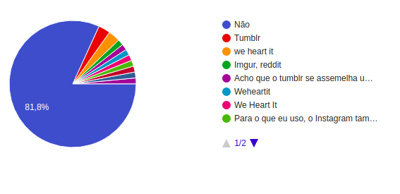

# Questionário

  Trata-se de uma técnica aplicada em grandes públicos e exige preparação prévia,
  na qual as perguntas devem ser bem elaboradas de acordo com o tipo de
  informação que deseja-se extrair.

### Rastreabilidade

  | Nome | Papel | Observação |
  |--|--|--|
  | Helena Goulart | Elaboradora | Membro da equipe |

### 1.1 Metodologia

  O questionário foi elaborado classificando o público em dois grupos: aqueles
  que são usuários do aplicativo e aqueles que não são. Dessa forma, foi possível
  direcionar as perguntas para a elicitação de requisitos. O questionário foi
  divulgado para os familiares dos integrantes da equipe e também no grupo de
  estudantes da Faculdade do Gama (FGA) no Facebook. No total foram 124 respostas obtidas.

### 1.2 Processo de desenvolvimento

##### Você é um usuário do Pinterest?

A pergunta acima direcionou os participantes para questionários distintos.

O questionário a seguir refere-se aos não-usuários do Pinterest:

#### Qual a sua idade?

#### Qual é o seu sexo?

#### Por que você não é um usuário do Pinterest?

O questionário a seguir refere-se aos usuários do Pinterest:

#### Qual a sua idade?

#### Qual é o seu sexo?

#### Através de qual dispositivo você prefere usar o Pinterest?

#### Como você classifica a sua experiência com o Pinterest?

#### Você conhece outra aplicação semelhante à esta?

#### Quais os temas que você pesquisa com frequência nessa rede social?
1. Arquitetura e Decoração;
2. Faça você mesmo (DIY);
3. Organização;
4. Moda e beleza;
5. Receitas;
6. Inspirações para datas comemorativas;
7. Fotos de celebridades;
8. Wallpapers;
9. Design;
10. Fotos de paisagens;
11. Tatuagens;
12. Fotos de animais;
13. Artes e ilustrações;
14. Frases inspiradoras;
15. Fanart;
16. Memes;
17. Fotografia;
18. Fotos de jogos de vôlei.

### 1.3 Requisitos Elicitados

| Código | Descrição |
|--|--|
| Q1 | A rede social deve abranger conteúdos que mantenham ativos os usuários que compõe o principal púlico, os jovens da faixa etária de 16 a 25 anos.|
| Q2 | A rede social deve conter uma experiência de usuário melhor para que o site possa ser tão acessado pelo público quanto o aplicativo. |
| Q3 | A interface do usuário deve ser agradável para melhorar as experiências e torná-las excelentes. |
| Q4 | A rede social deve procurar diferenciais perante seus maiores concorrentes, weheartit.com e tumblr.com. |
| Q5 | A rede social deve incluir sempre novos conteúdos sobre os temas mais pesquisados em busca de mantê-los atualizados, mas também procurar abranger temas diferentes para atrair novos públicos específicos, como os praticantes de esportes, por exemplo. |

### 1.4 Conclusão

  As perguntas realizadas no questionário foram importantes e necessárias para conhecimento do público, todavia não auxiliaram na elicitação de requisitos, uma vez que houveram poucos questionamentos direcionados às formas de uso da aplicação e mais perguntas referentes ao perfil do usuário.

### 1.5 Sugestões de melhoria

  A equipe concordou que um novo questionário com novas perguntas seriam mais colaborativo para a elicitação de mais requisitos. Para o novo questionário, sugerem-se as seguintes perguntas:

###### 1- Quais funcionalidades a seguir classificam a causa do seu uso do Pinterest?
  - Inspirações
  - Diversão

###### 2- Qual é a sua frequência de uso do chat do Pinterest?
  - Alta  
  - Média
  - Baixa

###### 3- A aba de Notificações cumpre o papel de avisar e chamar a sua atenção sobre a interação de outros usuários com o seu perfil?
  - Sim
  - Acredito que pode melhorar
  - Não

###### 4- Você considera o conteúdo do Pinterest exclusivo?
  - Com certeza
  - Encontro o mesmo conteúdo em outras fontes

###### 5- Você sente falta de uma amplitude maior de temas no Pinterest?
  - Sim
  - Não

###### 6- Você abre o Pinterest quando...
  - Não tenho nada para fazer
  - É sempre a minha primeira fonte de pesquisas
