# Rastreabilidade

# Introdução

É certo que para encontrar os requisitos de um projeto, além do desenvolvimento das técnicas utilizadas, as discussões apresentam características importantes da equipe: quais decisões foram tomadas, como e porquê. Este arquivo contém toda a rastreabilidade das entregas referente à materia de Requisitos de Software, abrangendo as conversas através do Slack do grupo e até mesmo áudios de conversas gravadas com a autroização da equipe.  

## Rich Picture e Argumentação

O desenvolvimento dessas duas técnicas conteve discussões que desenvolveram-se a princípio sobre os temas a serem abordados na argumentação. Contudo, ainda haviam dúvidas a respeito da pré rastreabilidade do Pinterest, conforme mostram as imagens abaixo:

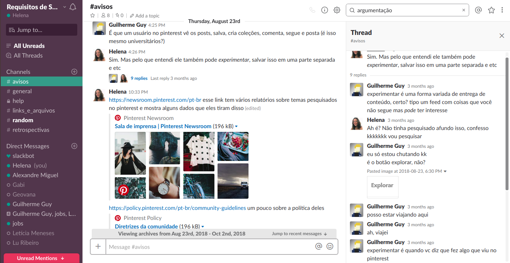

A primeira entrega foi idealizada pelo grupo pessoalmente, e a ata da reunião se encontra abaixo:

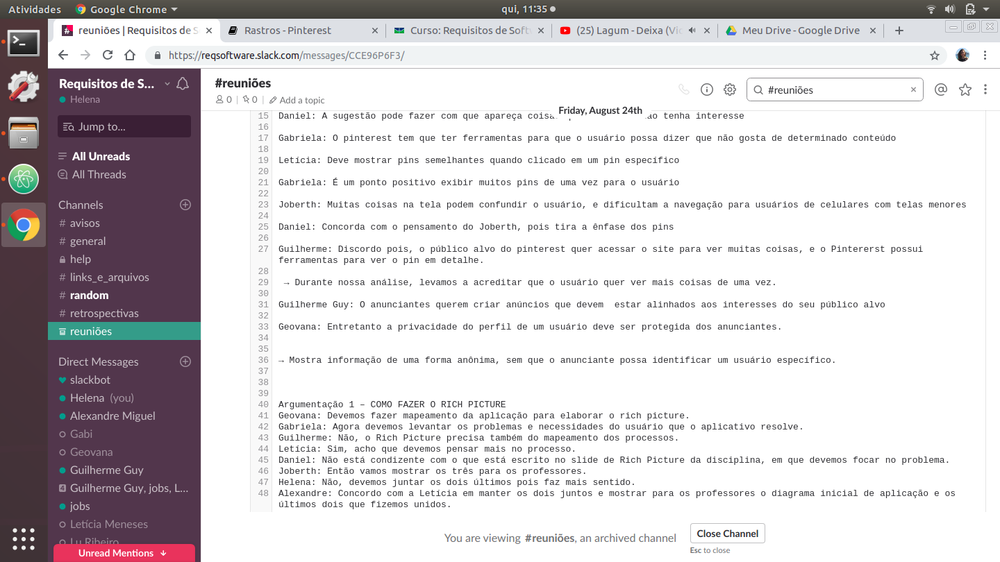

Os _feedbacks_ dados pelos professores para a primeira entega em conjunto foram gravados com a autorização dos mesmos, e podem ser encontrados [clicando aqui](https://drive.google.com/file/d/1j9n-iNVsDRARwqdHPceQfWB_8-kcIFGm/view?usp=sharing). As imagens abaixo mostram os momentos finais em que a equipe fez as alterações no projeto e validou com demais integrantes:

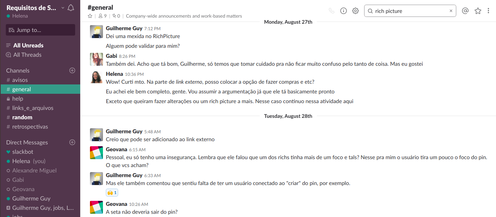

Após a entrega geral da equipe, coube ao grupo a discussão a respeito do desenvolvimento dos Rich Pictures individuais:

Desse modo, foram feitos 9 [Rich Pictures](rich_picture.md#rich-picture) com os temas [...] e 6 [Argumentações](argumentacao.md#argumentacao).

## Elicitação de Requisitos

A entrega de elicitação de requisitos envolvia diversas técnicas. Sendo assim, o primeiro ponto a ser levantado foram quais técnicas seriam utilizadas pela equipe. Para entender melhor quais poderiam ser aplicadas, os membros Guilherme, Alexandre e Helena conversaram com o professor Maurício. O resumo da conversa se encontra abaixo:

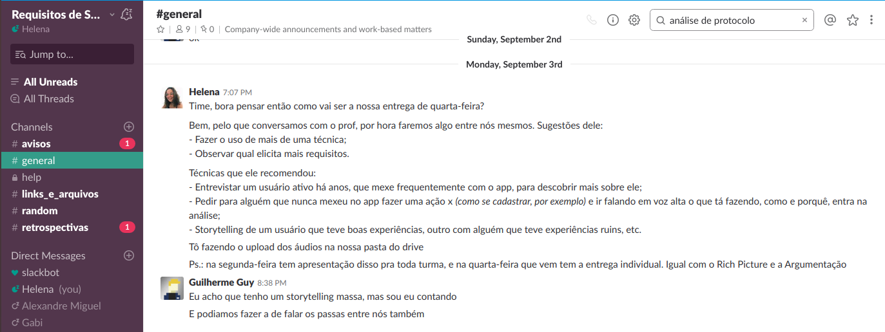

O grupo optou por se reunir na terça-feira (04/09) às 10h da manhã para aplicar algumas das técnicas de elicitação.

## Análise de Protocolo

Na reunião de 04/09 a equipe encontrou um universitário que aceitou participar da análise de protocolo. Os dados da análise foram anotados e se encontram abaixo:

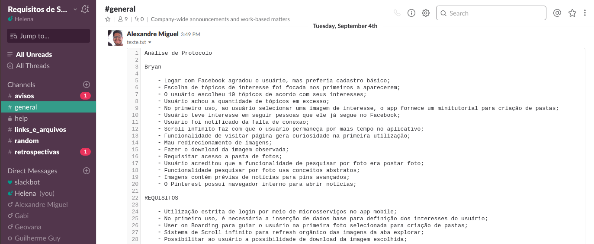

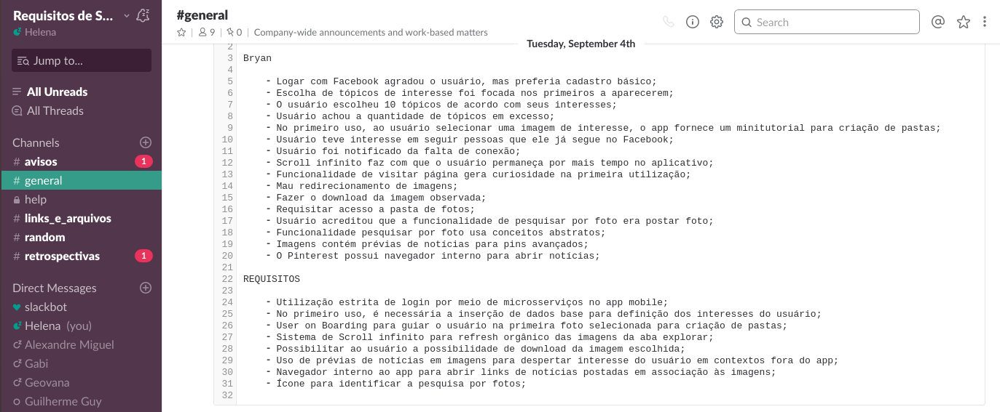

A análise não foi gravada em respeito ao universitário que não se sentiu confortável. Todavia, três membros da equipe (Alexandre, Letícia e Guilherme) anotaram as ações do estudante para que o resultado das anotações fossem feitos de maneira imparcial.

A partir desta [Análise de Protocolo](analise_protocolo.md#analise-de-protocolo-1) foram elicitados 14 requisitos.

## Análise de Discurso

Em virtude de um consenso do grupo, concluiu-se a importância de realizar um brainstorming de toda a equipe e gravá-lo afim de obter maior detalhamento da conversa. Para guiar a conversa, o membro Guilherme Guy se dispôs a ser um moderador. Para ouvir o áudio completo, basta [clicar aqui](https://drive.google.com/file/d/1VcwwykePY8xA2j7U9DbHl8KZQ-SyajmN/view). A partir dessa conversa, o grupo realizou técnica de [Análise de Discurso](analise_discurso.md#analise-de-discurso) e gerou 14 requisitos elicitados.

## Entrevista

O membro da equipe Alexandre Miguel optou por entrevistar uma estudante de Comunicação Organizacional e usuária do Pinterst, Fernanda Santos, com a intenção de conhecer uma visão técnica a respeito da aplicação. Suas dúvidas se resumiram em quais detalhes deveriam ser colocados na apresentação em sala de aula.

 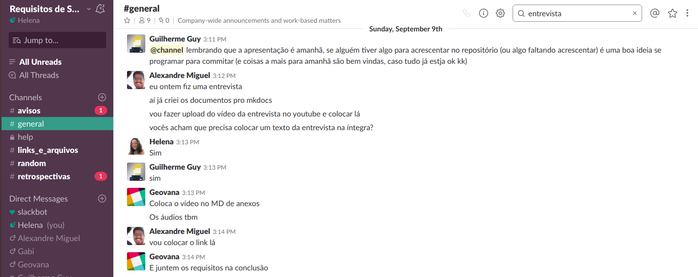

A [Entrevista](entrevista.md#entrevista) possibilitou 15 requisitos elicitados e o vídeo completo com a conversa gravada pode ser encontrado clicando [aqui](https://www.youtube.com/watch?v=1qWvLpRLVLQ).

## Introspecção

A integrante Gabriela optou por fazer uma Introspecção a respeito de uma jovem utilizando o Pinterest apenas para percorrer o conteúdo. A imagem abaixo mostra a primeira versão da técnica sendo aplicada:

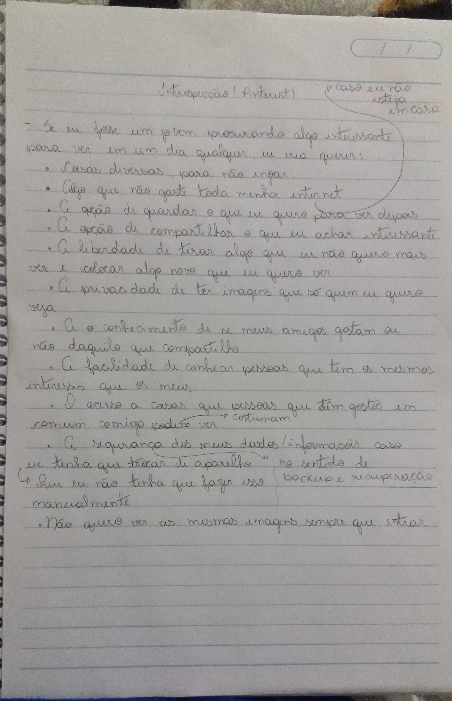

Após ser avaliada pelos professores de Requisitos de Software, o trabalho tornou-se mais específico, identificando quem é o autor em questão, quais são os seus objetivos e as suas necessidades. A [Introspecção](introspeccao.md#introspeccao-1) elicitou 10 requisitos.

## Storytelling

A técnica aqui apresentada foi desenvolvida pelos integrantes Alexandre, Geovanna, Guilherme, Joberth e Letícia.

A técnica foi aplicada duas vezes: uma pela integrante Letícia, e o áudio completo pode ser encontrado [aqui](https://drive.google.com/file/d/1e8fT9ZdSobEw3JXYYQ4BiqRrP96_Q2EV/view?usp=sharing). 

Na segunda vez, a técnica foi aplicada pelo integrante Guilherme, e o áudio completo pode ser encontrado [aqui](https://drive.google.com/file/d/1HUBqnCne5n_EPXjyfOXTLEs_kyH_1PAv/view?usp=sharing).

## Questionário

A integrante Helena entrou em contato com a monitora Luciana para compreender qual possível técnica que ainda não havia sido aplicada para esta entrega e ainda seria possível de desenvolver, e recebeu o conselho de realizar um Questionário.

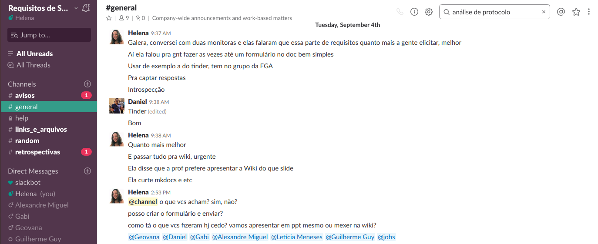

A equipe achou um pouco arriscado, mas a integrante da equipe optou por desenvolver mesmo que desse errado, para compreender quais as técnicas seriam interessantes ou não para ajudar na elicitação de requisitos do Pinterest.

Guilherme Guy sugeriu uma alteração e após a edição final o questionário foi divulgado.

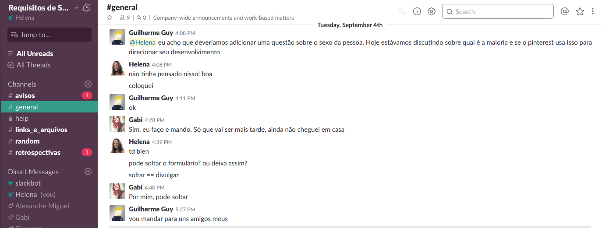

Após conversar com os professores, concluiu-se que as perguntas feitas todavia agregaram pouco em requisitos para o aplicativo, e foram feitas sugestões de um novo questionário que possivelmente poderia ser aplicado posteriormente. Em virtude disso, o [Questionário](questionario.md#questionario) elicitou apenas 5 requisitos.

## Cenários e Léxicos

O primeiro passo para a modelagem foi citar diversas palavras que viessem à mente e que fizessem sentido dentro do Pinterest:

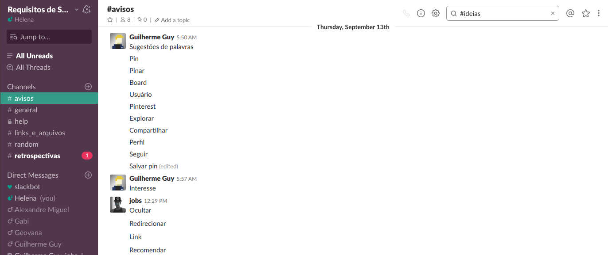

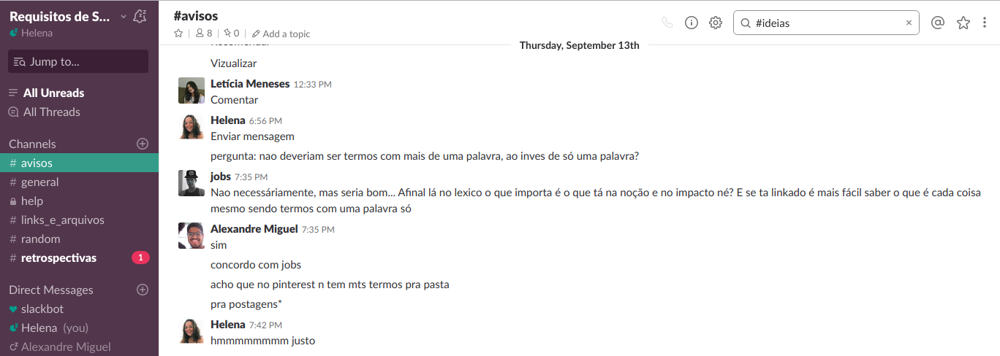

A ferramenta de entrega e apresentação foi mantida como o _github pages_, mas colocar os _links_ que ligavam os cenários aos léxicos exigiram mais trabalho e esforço, conforme mostra a imagem abaixo:

O primeiro encontro com os professores para conversar sobre a entrega foi anotado pela equipe e se encontra a seguir:

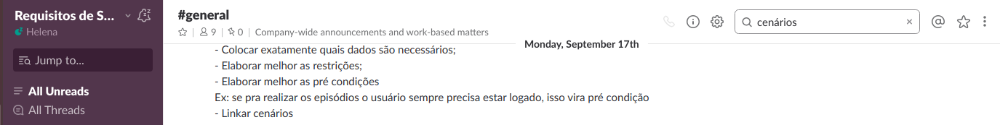

O áudio completo do feedback pode ser encontrado [clicando aqui](https://drive.google.com/file/d/1Kqh16TF_1ufzFJCfwLwQl_SjcY9fjM5C/view?usp=sharing). A equipe permaneceu enriquecendo o trabalhado e investindo em melhorias nos tópicos que já haviam sido feitos.

A entrega final da modelagem contou com 36 [Léxicos](lexicos.md#lexicos) e 24 [Cenários](cenarios,md#cenarios).

## Diagramas de Casos de Uso e Especificações de Casos de Uso

É certo que os cenários serviram como suporte para o desenvolvimento desta entrega. A primeira tarefa da equipe era definir como seriam separados os diagramas entre os integrantes.

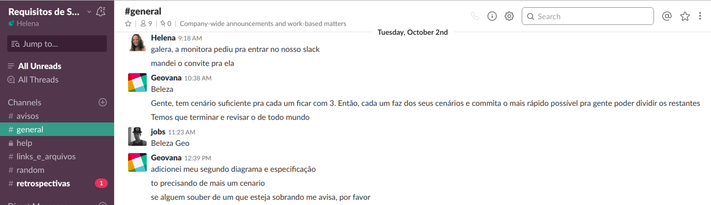

Depois disso, os diagramas foram compartilhados com os demais membros do grupo para serem validados

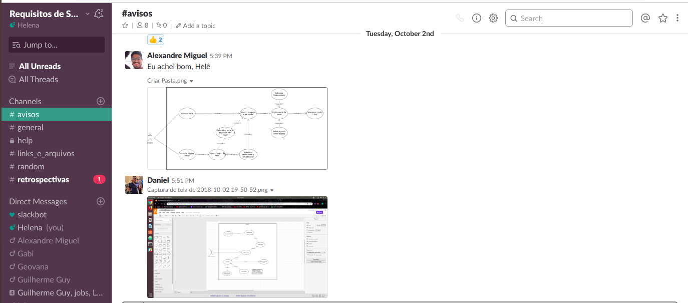

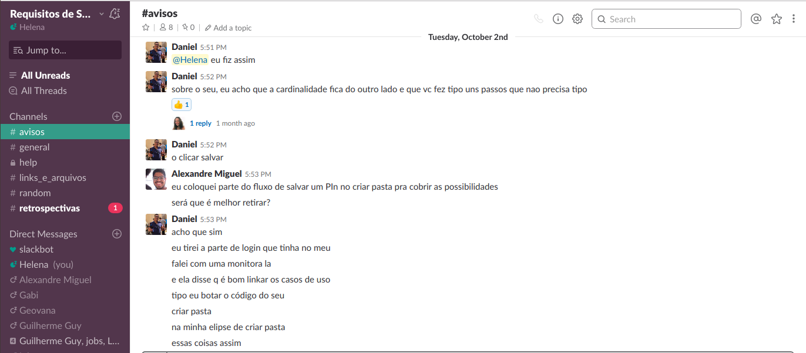

A cardinalidade foi uma dúvida recorrente, mas que pode ser sanada dentro da própria equipe

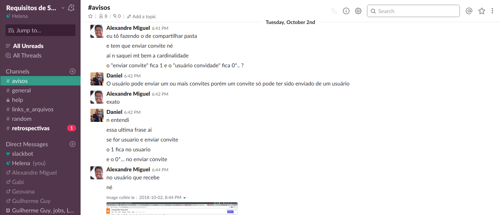

Sendo assim, foram desenvolvidos 26 [Diagramas de Casos de Uso](diagramas_caso_uso.md#DCU1) e 26 [Especificações de Casos de Uso](especificacoes_caso_uso.md#ECU-1)

## Especificação Suplementar

O documento de [Especificação Suplementar](especificacao_suplementar.md#especificacao-suplementar) teve como referencial teórico um documento da instituição FUPAR. Dessa forma, tornou-se possível integrar ao Pinterest os conceitos apresentados em sala e o referencial. O documento foi desenvolvido de maneira colaborativa pela equipe através de uma pasta no Drive.

## Backlog do Produto

A entrega referente ao backlog foi iniciada pelos alunos Alexandre e Helena. Através de uma conversa pelo WhatsApp, foi definida a estrutura do backlog: as histórias, como seriam tratados os atores de cada uma e o padrão de linguagem.

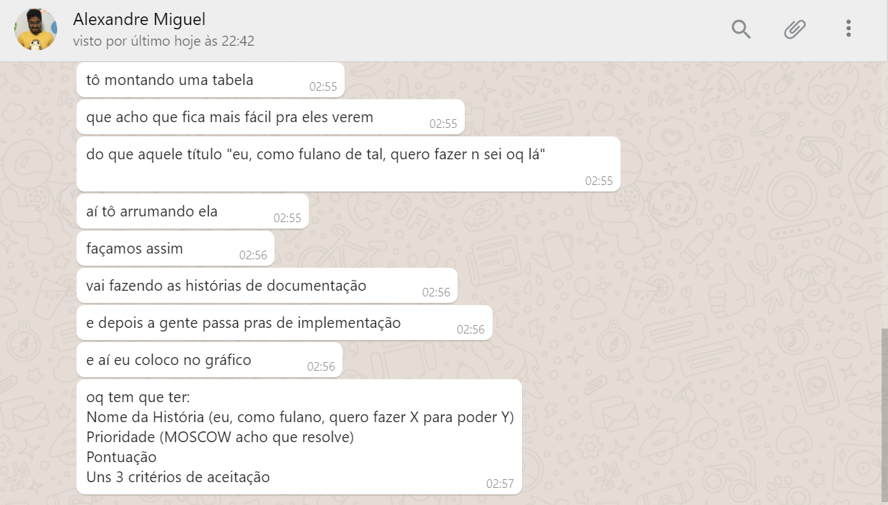

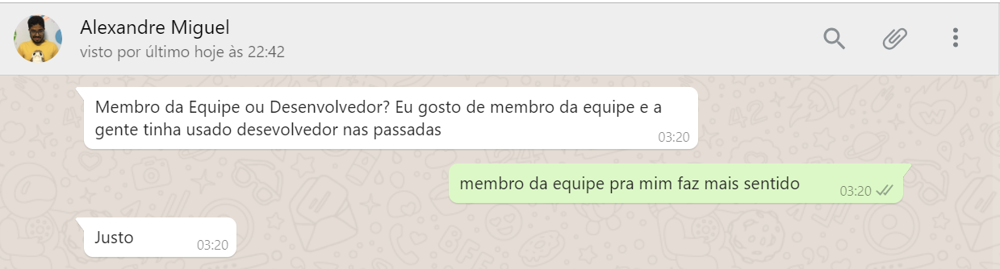

O método de pontuação das sprints foi Fibonacci de acordo com a experiência prévia em Métodos de Desenvolvimento de Software.

Após estruturada a primeira parte do trabalho, os demais membros da equipe desenvolveram mais hitórias de usuário que foram divididas organizadas nos épicos e nas _sprints_.

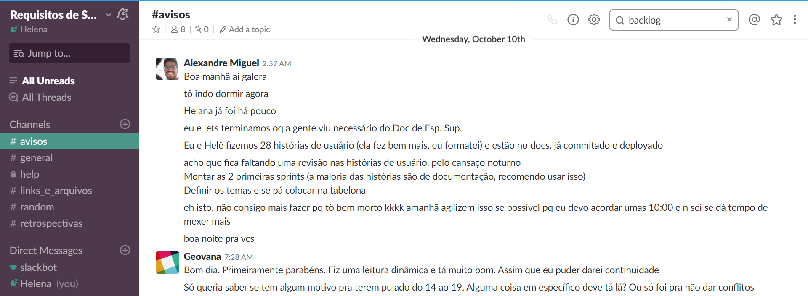

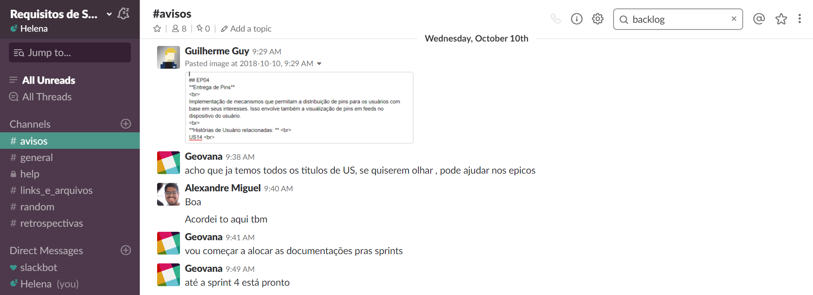

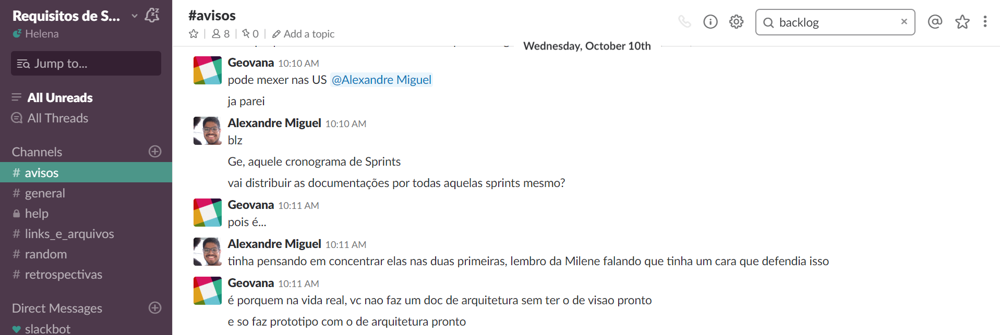

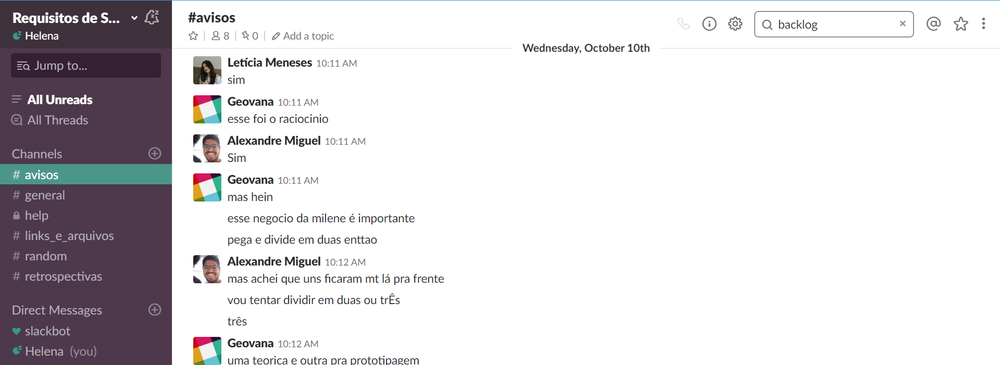

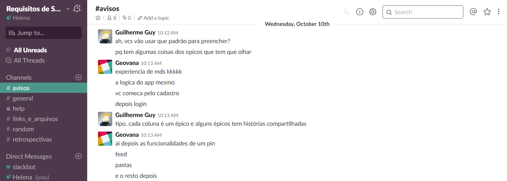

A entrega do [Backlog do Produto](backlog.md#backlog-do-produto) contou com 10 Épicos, 10 _Sprints_ e 39 Histórias de Usuário.

## NFR

A estratégia da equipe para o desenvolvimento do NFR foi iniciar os esquemas antes do conteúdo ser apresentado em sala de aula. Alguns membros já tiveram contato com a técnica através da disciplina de Métodos de Desenvolvimento de Software. Outros, no entanto, não a conheciam ainda e tiveram dificuldades em começar a entrega posterior às explicações dos professores.

Por serem requisitos não funcionais, os temas foram divididos de acordo com o documento de Especificação Suplementar.

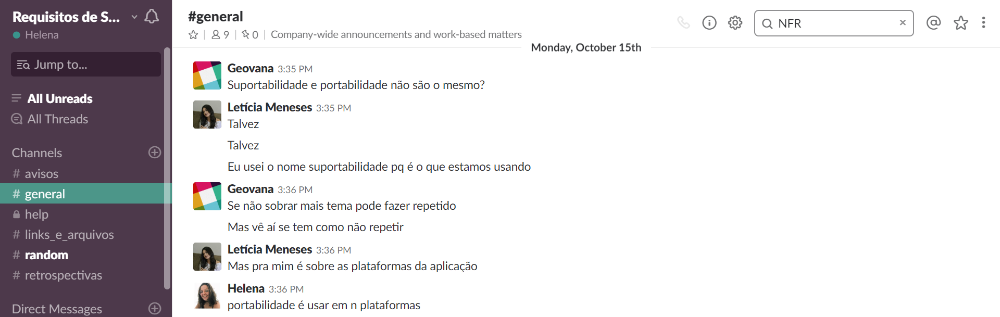

Aqueles que já estavam com o NFR devidamente feitos apresentaram ao professor no final da aula para receber alguns _feedbacks_ que foram repassados à equipe:

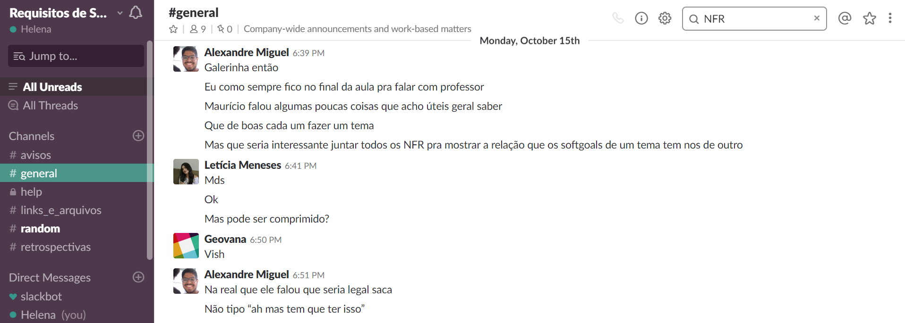

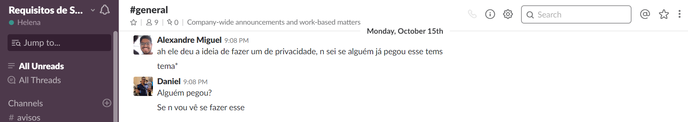

A validação entre os integrantes da equipe se manteve nesta entrega, e foram construtivos para a apresentação em sala.

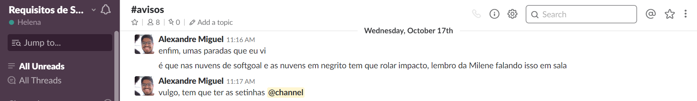

Ao todo foram feitos 8 [NFR](nfr.md#introducao) pela equipe.

## i*

O desenvolvimento do i* contou passou por dois processos: o primeiro, antes da apresentação para os professores, onde alguns membros desenvolveram _dependency_ e outros desenvolveram os _rationales_.

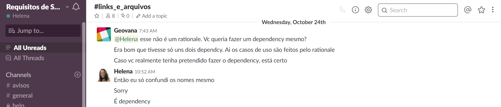

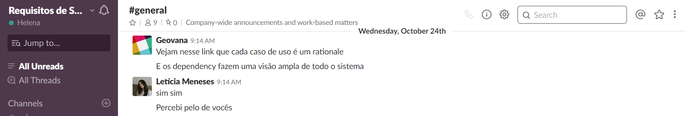

Ao compreender a necessidade de unir as partes realizadas individualmente em um único _Strategic Dependency Models_ que unisse todos, a equipe se organizou para utilizar a ferramenta Prezi, em busca de trazer uma visualização melhor do conteúdo

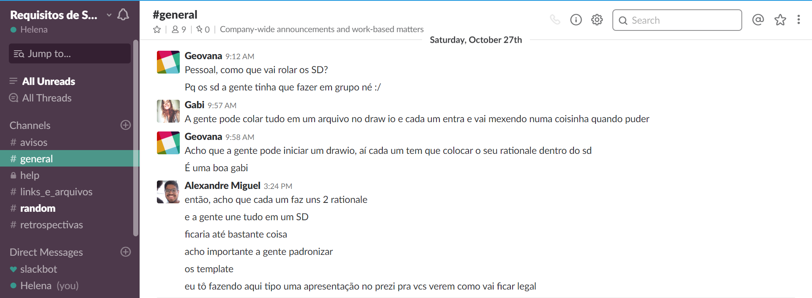

A troca de _fedbacks_ entre os integrantes gerou discussões construtivas a respeito da técnica e auxiliaram na apresentação final

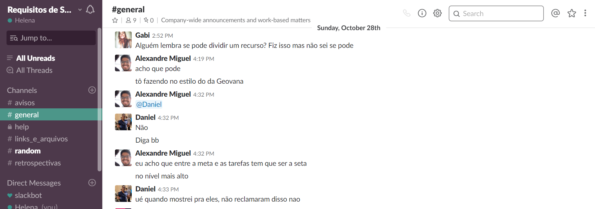

Conforme combinado, a apresentação foi organizada no Prezi e validada pela equipe

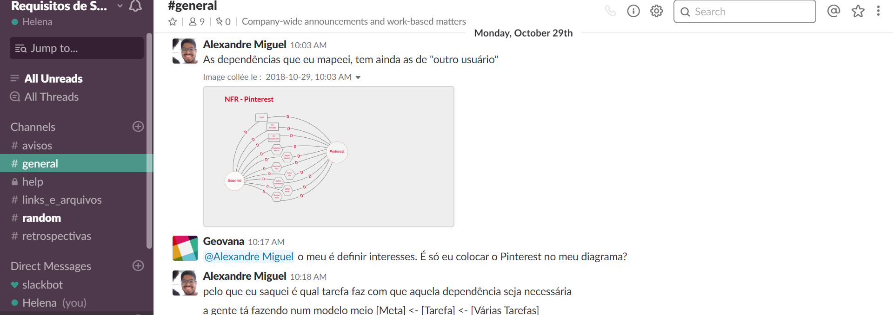

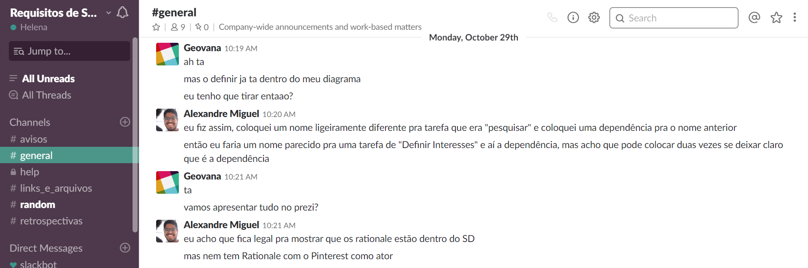

Foram feitos 2 [_Strategic Dependency Models_](iStar.md#strategic-dependency-models) e 9 [_Strategic Rationale Models_](iStar.md#strategic-rationale-models).

## Análise

Ao conversar com os professores, a equipe percebeu que estava com baixa posição no ranking de grupos da disciplina. Concluiu-se então a necessidade de mudar a estratégia do grupo em busca de um melhor desempenho nas entregas finais da matéria. Sendo assim, Guilhereme sugeriu duplas de pareamentos e divisão dos temas para a entrega da Análise.

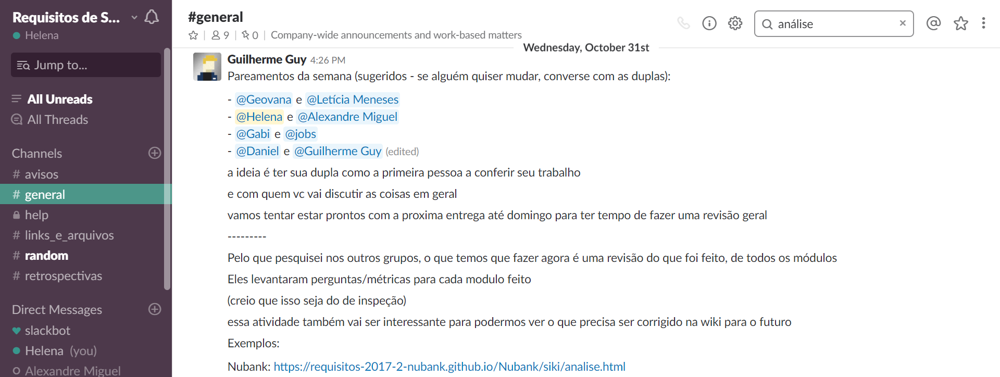

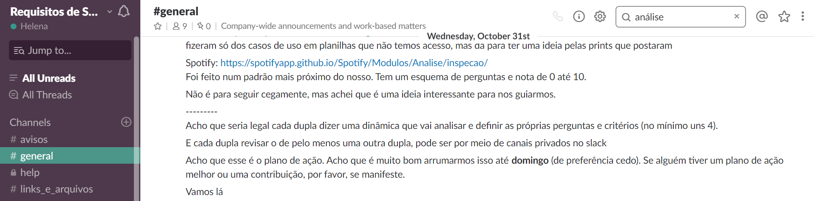

As conversas pelo slack auxiliaram as estratégias a serem utilizadas durante o processo

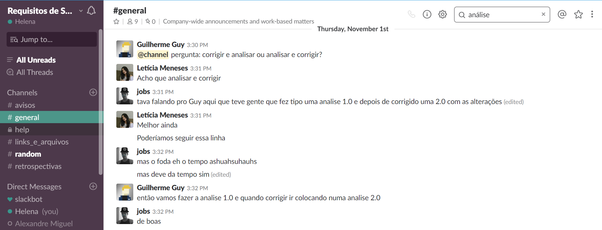

Um ponto levantado pelo grupo seria como avaliar da maneira mais técnica e específica e menos abstrata possível. As escolhas foram definidas graças ao referencial teórico utilizado, tais como [Rosângela Gregolin](http://cassiopea.ipt.br/teses/2007_EC_Rosangela_Gregolin.pdf), [Fábio Paim](http://wer.inf.puc-rio.br/WERpapers/pdf_counter.lua?wer=WER02&file_name=paim.pdf), [Anselmo Couto](https://www.researchgate.net/publication/221235239_Um_Processo_de_Validacao_de_Requisitos_Nao-Funcionais_Baseado_no_NFR-Framework), [Maurício Serrano](http://www-di.inf.puc-rio.br/~julio/Mauricio.pdf), e artigos da IBM como [_Creating Use Case_](https://www.ibm.com/support/knowledgecenter/SSB2MU_8.1.3/com.ibm.rhp.uml.diagrams.doc/topics/rhp_c_dm_use_case_diagrams.html), [_Use Cases_](https://www.ibm.com/developerworks/rational/library/content/RationalEdge/may02/m_chapter4_jr.pdf) e [_Creating Use Case Models_](https://www.ibm.com/support/knowledgecenter/SSB2MU_8.1.4/com.ibm.rhp.harmonyse.doc/topics/t_createusecases.html).

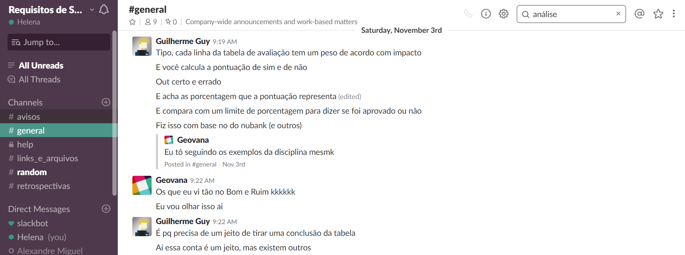

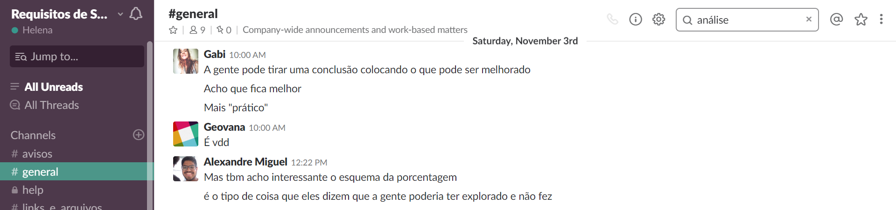

As técnicas a serem relacionadas aos requisitos elicitados foi uma discussão construtiva que possibilitou definir quais _links_ seriam colocados entre os requisitos.

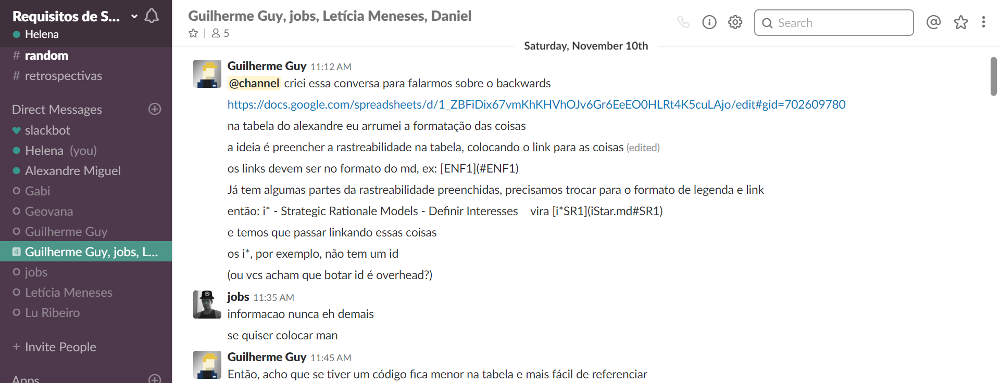

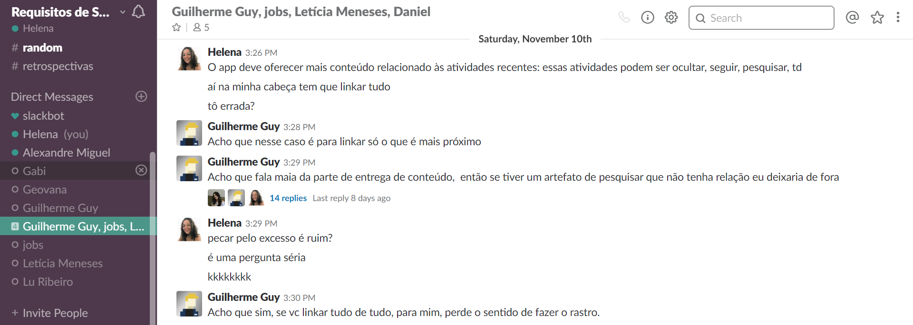

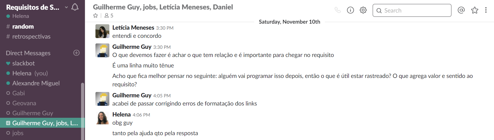

As duplas de pareamento utilizaram diferentes padrões de apresentação, como planilhas feitas em _markdown_, na ferramenta _Excel_, e até mesmo representação através de um design ilustrativo, mas não deixaram de validar o conteúdo com a equipe, conforme a imagem abaixo:

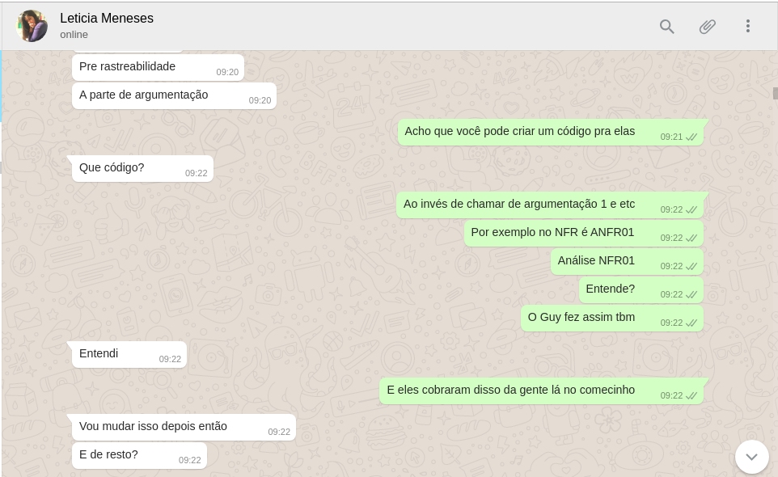

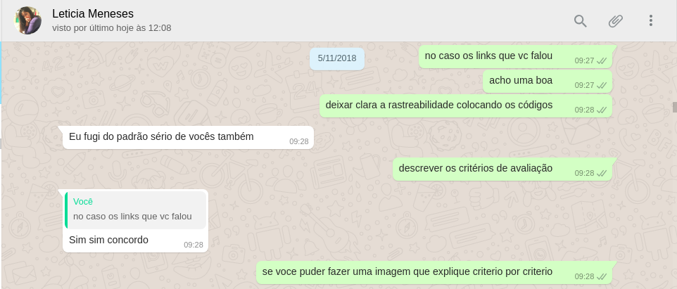

Apesar de não ser pradronizada, a [Análise](analise.md#introducao) trouxe resultados importantes para a equipe que seriam utilizados posteriormente na pós-rastreabilidade.

## Pós-Rastreabilidade

A entrega da Análise trouxe melhor desempenho e resultados para a equipe, e todos optaram por manter a estratégia para a Pós-Rastreabilidade.

A primeira etapa foi organizar de acordo com as exigências dos professores

Depois disso, foram definidas as duplas de pareamento e suas respectivas responsabilidades

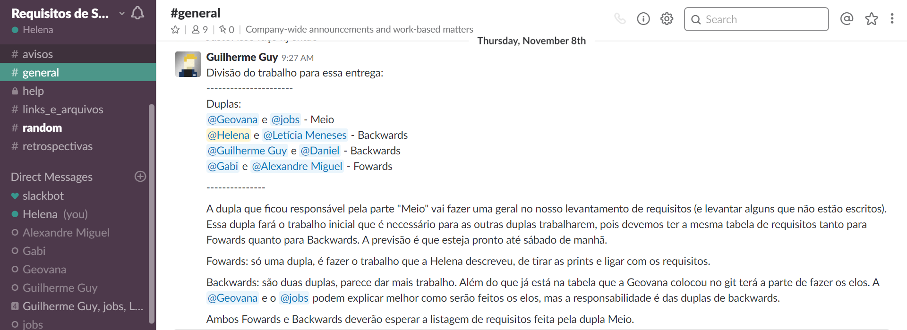

Os requisitos foram revisados e organizados em uma planilha, para que todos pudessem validar a lista completa de requisitos

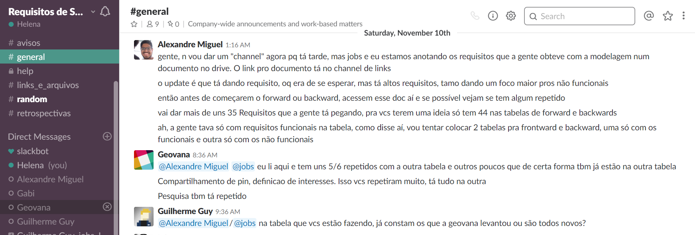

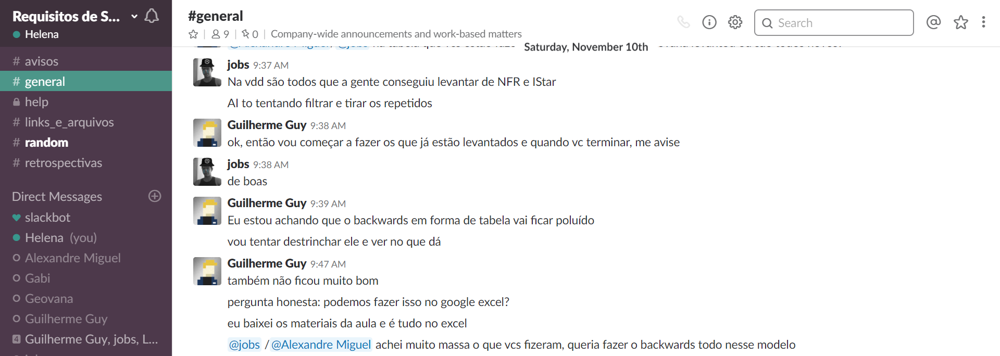

Para demonstrar como os requsitos se encontram na prática no Pinterest, concluiu-se a importância de incluir fotos da aplicação na apresentação. Todavia, o grupo entrou em discordância em relação à plataforma utilizada como referência para os requisitos: se mobile ou web. A decisão final foi manter as duas versões.

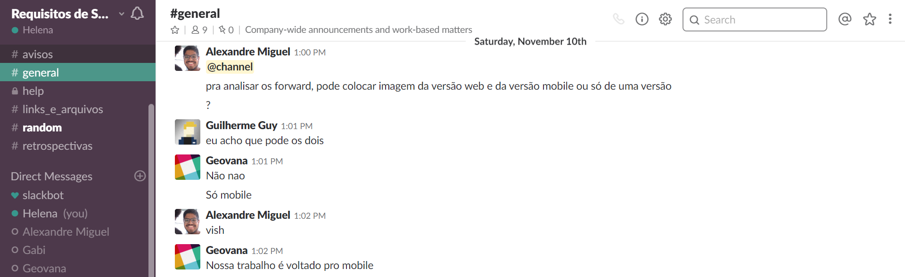

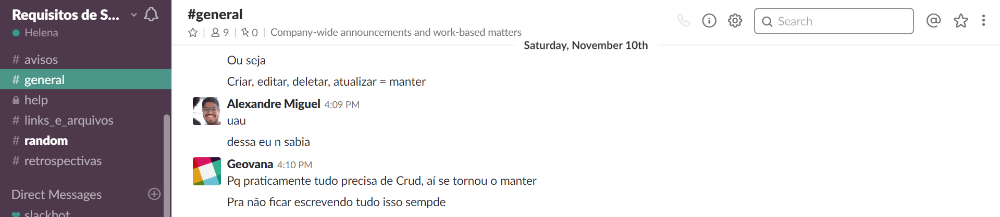

Após apresentar pela primeira vez para os professores, o grupo realizou uma reunião e designou as alterações finais que deveriam ser feitas:

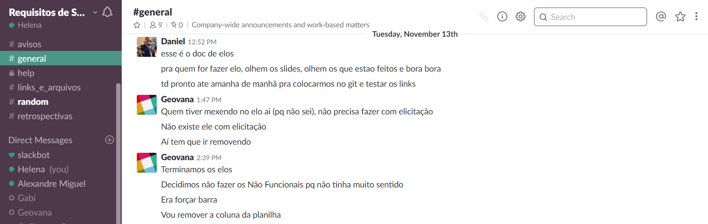

Como de praxe, a validação se manteve entre o grupo

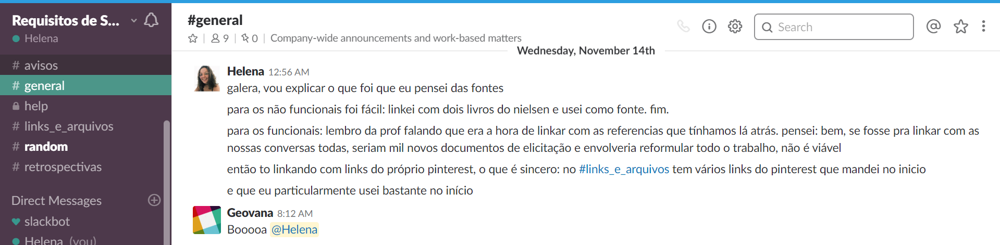

Ao final da [Pós-Rastreabilidade](backward_from.md#introducao) houveram 52 requisitos funcionais e 18 requisitos não funcionais.
