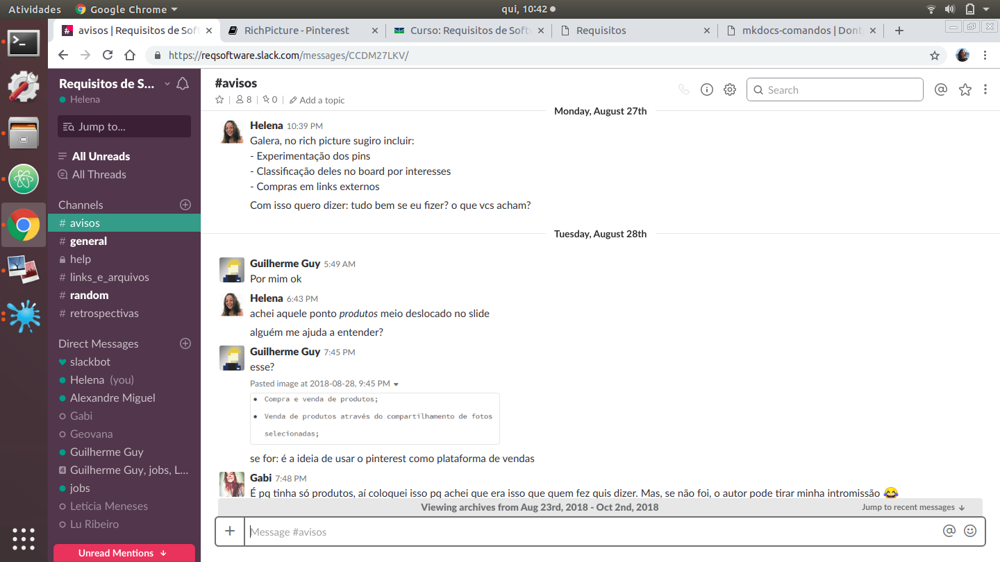

# Rastreabilidade

# Introdução

É certo que para encontrar os requisitos de um projeto, além do desenvolvimento da modelagem e da elicitação de requisitos, existem diversas discussões a respeito das técnicas utilizadas. Este arquivo contém toda a rastreabilidade das entregas referente à materia de Requisitos de Software, contendo as conversas através do Slack do grupo e até mesmo áudios de conversas gravadas com a autroização da equipe.  

## Rich Picture e Argumetnação

Para o desenvolvimento dessas duas técnicas as discussões desenvolveram-se a princípio com as primeiras ideias para a argumentação. Contudo, ainda haviam dúvidas a respeito das técnicas e até mesmo do Pinterest:

Após a entrega geral da equipe, coube ao grupo a discussão a respeito do desenvolvimento dos Rich Pictures individuais:

Desse modo, foram feitos x [Rich Pictures](rich_picture.md#rich-picture) com os temas [...]
