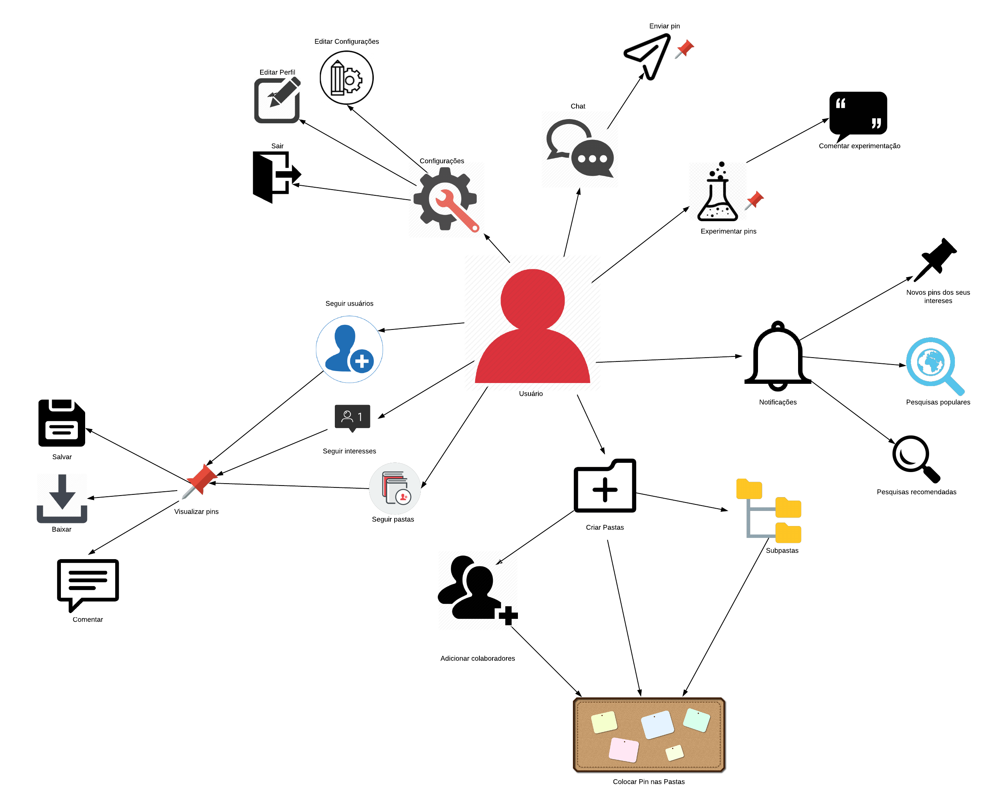
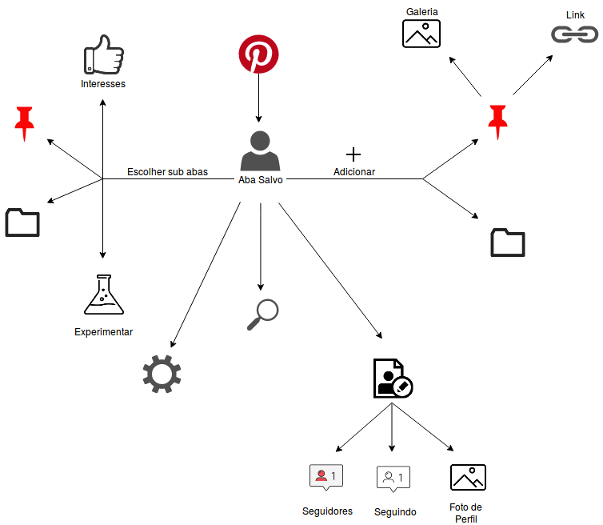
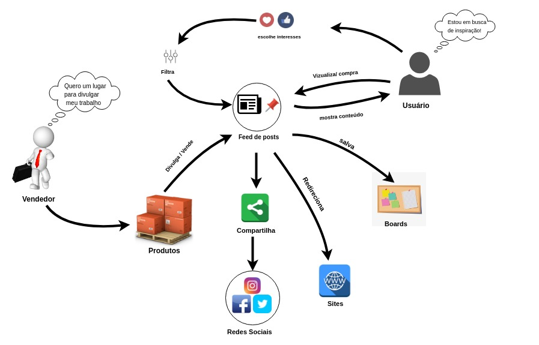

# Pin

Rich Picture que descreve todas as ações realizadas referentes á um pin. As  ações podem são realizadas pelo usuário, podendo ele ser um consumidor ou anunciante.

# Pins Especiais

Rich Picture que descreve as funcionalidades e recursos dos Pins Especiais.

# Usuário

Rich Picture com foco no usuário e nas ações que ele pode realizar no sistema.

# Aba Salvos

Rich Picture que apresenta as funcionalidades existentes dentro da aba "Salvos".

# Usuário vendedor e Usuário comum

Rich Picture que apresenta a interação do usuário comum com um usuário que desfruta do poder do marketing no Pinterest divulgando seus produtos.

