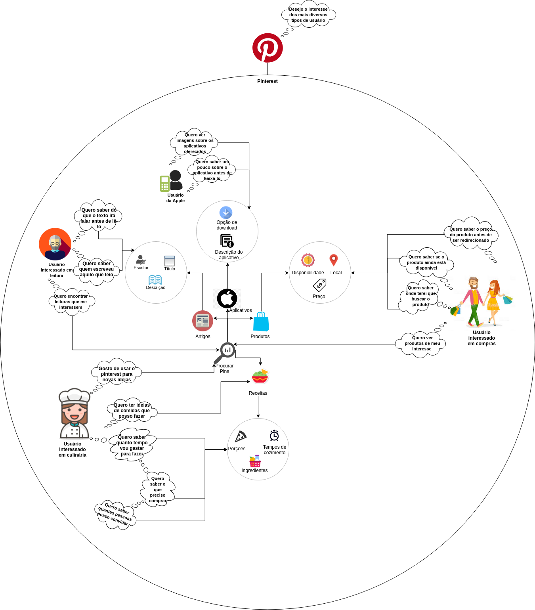
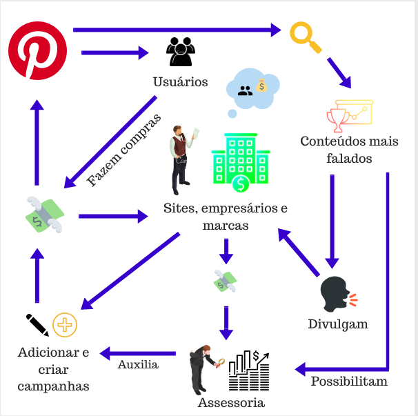
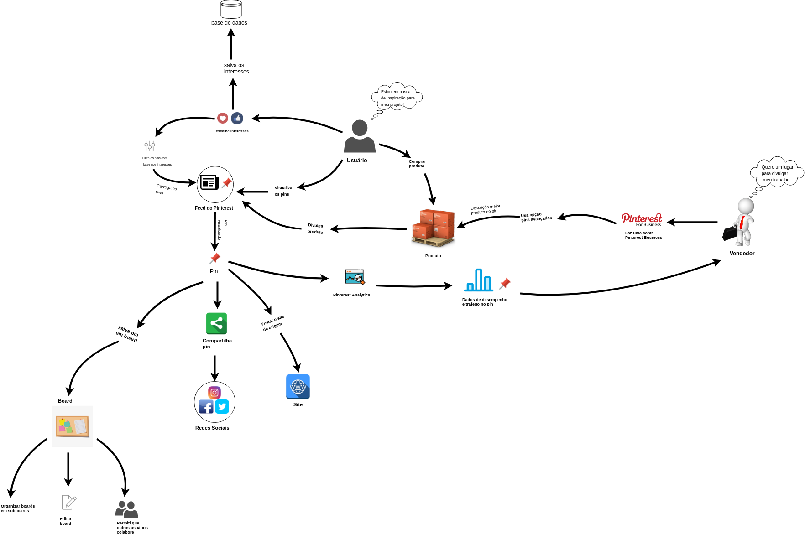
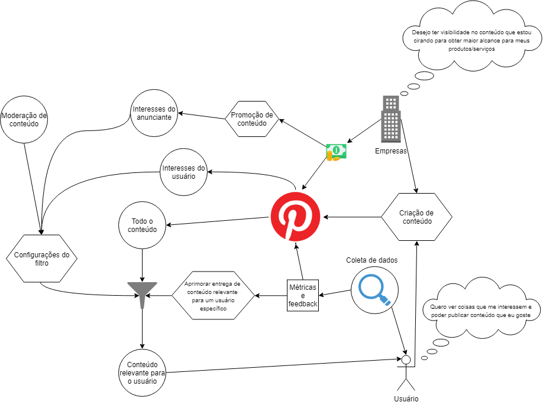

# Rich Picture

## Versionamento

|  Versão | Data | Modificação | Autor |
|  :------: | :------: | :------: | :------: |
|  1.0 | 06/09/2018 | Adição do [RP1](#rp1-pin) feito por todo o grupo | Todo o Grupo |
|  1.1 | 17/09/2018 | Adição da primeira versão do [RP5](#rp5-usuario) | Daniel Maike |
|  1.2 | 14/10/2018 | Adição da primeira versão do [RP6](#rp6-aba-salvos) | Geovana Ramos |
|  1.3 | 01/10/2018 | Adição da primeira versão do [RP7](#rp7-usuario-vendedor-e-usuario-comum) | Joberth Rogers |
|  1.4 | 02/10/2018 | Adição da primeira versão do [RP2](#rp2-pins-especiais) | Gabriela Medeiros |
|  1.5 | 02/10/2018 | Adição da primeira versão do [RP8](#rp8-pinterest-e-entrega-de-conteudo-ao-usuario) | Guilherme Guy |
|  1.6 | 09/11/2018 | Adição da primeira versão do [RP3](#rp3-tipos-de-pins) | Alexandre Miguel |
|  1.7 | 14/11/2018 | Adição da primeira versão do [RP4](#rp4-fluxo-do-anunciante) | Helena Goulart |
|  2.0 | 14/11/2018 | Adição da segunda versão do [RP7](#rp7-usuario-vendedor-e-usuario-comum) | Joberth Rogers |
|  2.1 | 14/11/2018 | Adição da segunda versão do [RP5](#rp5-usuario) | Daniel Maike |
|  2.2 | 14/11/2018 | Adição da segunda versão do [RP6](#rp6-aba-salvos) | Geovana Ramos |
|  2.3 | 14/11/2018 | Adição da segunda versão do [RP2](#rp2-pins-especiais) | Gabriela Medeiros |
|  2.4 | 14/11/2018 | Adição da segunda versão do [RP3](#rp3-tipos-de-pins) | Alexandre Miguel |
|  2.5 | 15/11/2018 | Adição da segunda versão do [RP8](#rp8-pinterest-e-entrega-de-conteudo-ao-usuario) | Guilherme Guy |
|  3.0 | 15/11/2018 | Adição da terceira versão do [RP3](#rp3-tipos-de-pins) | Alexandre Miguel |

##  Introdução

  O Rich Picture é uma técnica de requisitos de software, elaborada na fase de pré-rastreabilidade. São desenho feitos a mão ou digitalmente a fim de expressar ideias, que representam um subsistema de um sistema maior. É um artefato considerado informal e muito útil na identificação das partes envolvidas, a fim abrir espaço para discussões e ser uma forma de compreender o problema amplamente.

## RP1 - Pin

Rich Picture que descreve todas as ações realizadas referentes á um pin. As  ações podem são realizadas pelo usuário, podendo ele ser um consumidor ou anunciante.
Os conceitos levados em conta para a elaboração desse rich picture estão dispostos na [Argumentação 2](argumentacao.md#ar2-rich-picture).

## RP2 - Pins Especiais

### Versão 1.0

Rich Picture que descreve as funcionalidades e recursos dos Pins Especiais.

### Versão 2.0

## RP3 - Tipos de Pins

Rich Picture que descreve os tipos de Pins.

### Versão 1.0

### Versão 2.0

### Versão 3.0

## RP4 - Fluxo do Anunciante

### Versão 1.0

## RP5 - Usuário

Rich Picture com foco no usuário e nas ações que ele pode realizar no sistema.

### Versão 1.0

### Versão 2.0

## RP6 - Aba Salvos
Rich Picture que apresenta as funcionalidades existentes dentro da aba "Salvos".

### Versão 2.0

## RP7 - Usuário vendedor e Usuário comum

Rich Picture que apresenta a interação do usuário comum com um usuário que desfruta do poder do marketing no Pinterest divulgando seus produtos.

### Versão 1.0

### Versão 2.0

## RP8 - Pinterest e entrega de conteúdo ao Usuário

Rich Picture que apresenta a interação do Pinterest e do usuário no ambito de entrega de conteúdo relevante, com o filtro de conteúdo e o feedback loop de metricas do usuário.

### Versão 1.0

### Versão 2.0

